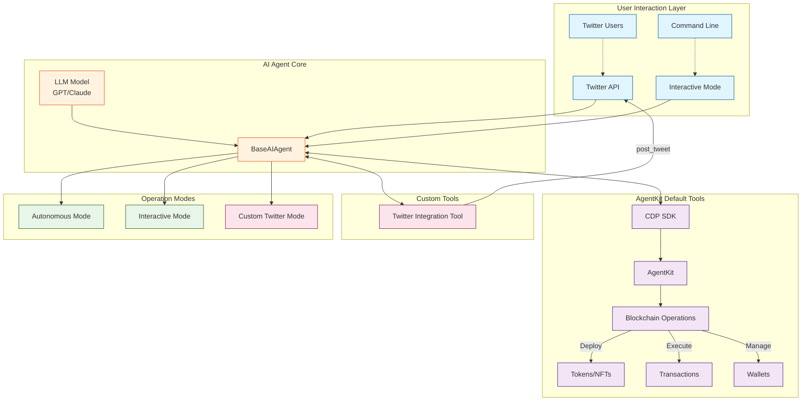

# Base AI Agent

An AI-powered agent that operates on the Base blockchain and interacts with users through Twitter. Built with Coinbase's CDP Agentkit, this agent can perform various blockchain operations and engage in autonomous social interactions.

For an in-depth guide, refer to our **[How to Create a Web3 AI Agent with Coinbase AgentKit](http://www.quicknode.com/guides/ai/create-a-web3-ai-agent-with-coinbase-agent-kit)** guide on Quicknode.

## Features

- AI-powered responses
- Integration with Base mainnet and testnet
- Twitter interaction capabilities
  - Responds to mentions
  - Autonomous tweeting
- CDP Wallet management
- Autonomous mode for periodic engagement
- Blockchain operations (token deployment, NFT minting)

## Prerequisites

- Node.js
- Twitter Developer Account with API credentials
- OpenAI API key
- Coinbase CDP API credentials

## Architecture



## Installation

1. Clone the repository

  ```sh
  git clone https://github.com/quiknode-labs/qn-guide-examples.git
  cd ai/coinbase-ai-agent
  ```

2. Install dependencies:
  ```sh
  npm install
  ```

3. Copy the example environment file and fill in your credentials:
  ```sh
  cp .env.example .env
  ```

## Usage

The agent can be run in two modes:

### Autonomous Mode

This mode runs the agent autonomously, generating periodic tweets and blockchain interactions.

```sh
npm run start:autonomous
```

### Twitter Mode

This mode monitors Twitter for mentions and responds to user interactions.

```sh
npm run start:mentions
```

### Running Tests

To run the tests, use the following command:
```sh
npm run test
```

## Configuration

The project uses environment variables for configuration. Add the following variables into your .env file:

```env
TWITTER_API_KEY="your-twitter-api-key"
TWITTER_API_SECRET="your-twitter-api-secret"
TWITTER_ACCESS_TOKEN="your-twitter-access-token"
TWITTER_ACCESS_SECRET="your-twitter-access-secret"
TWITTER_USER_ID="your-twitter-user-id"

OPENAI_API_KEY="your-openai-api-key"

CDP_API_KEY_NAME="your-cdp-api-key-name"
CDP_API_KEY_PRIVATE_KEY="your-cdp-api-key-private-key"
```

## Contributing

1. Fork the repository
2. Create your feature branch (`git checkout -b feature/amazing-feature`)
3. Commit your changes (`git commit -m 'Add amazing feature'`)
4. Push to the branch (`git push origin feature/amazing-feature`)
5. Open a Pull Request

## Author

Created as part of the Quicknode guide preparation.

