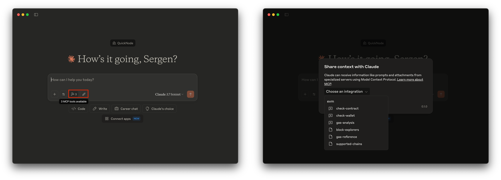

# EVM MCP Server

An MCP server built in TypeScript that enables LLM agents to perceive blockchain data across multiple EVM-compatible networks using QuickNode endpoints.

**Written tutorial of this project**: [Create an EVM MCP Server with Claude Desktop](https://www.quicknode.com/guides/ai/evm-mcp-server?utm_source=internal&utm_campaign=sample-apps&utm_content=evm-mcp-server)



## Tech Stack

- [MCP TypeScript SDK](https://www.npmjs.com/package/@modelcontextprotocol/sdk)
- [TypeScript](https://www.typescriptlang.org/)
- [Viem](https://viem.sh/)
- [QuickNode](https://www.quicknode.com?utm_source=internal&utm_campaign=sample-apps&utm_content=evm-mcp-server)

## Features

- **MCP-Compatible**: Built using the Model Context Protocol SDK to directly talk to LLM agents
- **Multi-Chain Support**: Works with Ethereum, Base, Arbitrum, Avalanche, and BSC
- **Core EVM Methods**: Includes `eth_getBalance`, `eth_getCode`, and `eth_gasPrice`
- **LLM Prompts**: Pre-built prompts for wallet analysis, contract inspection, and gas price evaluation

## Prerequisites

- [Node.js](https://nodejs.org/en) >= 18
- QuickNode account (create a free one [here](https://www.quicknode.com/signup?utm_source=internal&utm_campaign=sample-apps&utm_content=evm-mcp-server))
- TypeScript
- Claude Desktop or any other MCP-compatible agent runner

### QuickNode Endpoint and Token ID
1. Sign up at [QuickNode](https://www.quicknode.com/signup?utm_source=internal&utm_campaign=sample-apps&utm_content=evm-mcp-server)
2. Create a multichain endpoint. See the [How to Use the QuickNode Multichain Endpoint](https://www.quicknode.com/guides/quicknode-products/how-to-use-multichain-endpoint?utm_source=internal&utm_campaign=sample-apps&utm_content=evm-mcp-server) for more details.
3. From the endpoint URL `https://your-endpoint.quiknode.pro/your-token-id/` (for Ethereum) or 
   `https://your-endpoint.NETWORK.quiknode.pro/your-token-id/` (for other chains):
   - Extract the endpoint name (replace `your-endpoint`)
   - Extract the token ID (replace `your-token-id-here`)
4. Keep the endpoint name and token ID for later use.

## Project Instructions

1. Clone the repository

```bash
git clone https://github.com/quiknode-labs/qn-guide-examples.git
cd qn-guide-examples/AI/evm-mcp-server
```

2. Install dependencies

```bash
npm install
```

3. Build the project

Compile the TypeScript code:

```bash
npm run build
```

## Project Structure

```bash
├── chains.ts           # Chain configuration and QuickNode endpoint mapping
├── clients.ts          # Viem public client creator for RPC connections
├── index.ts            # Main entry point that sets up the MCP server
├── package.json        # Package configuration
├── prompts.ts          # Defines LLM prompts for blockchain analysis tasks
├── resources.ts        # External references and helpers
├── tools.ts            # Implements the EVM RPC methods as MCP tools
└── tsconfig.json       # TypeScript configuration
```


## Configure Claude Desktop 

Environment variables are used to configure the server. These variables will be defined in Claude Desktop's configuration file, `claude_desktop_config.json`.

To configure, open the **Claude Desktop** app, go to **Claude** > **Settings** > **Developer**. Then, modify the `claude_desktop_config.json` file with the following content: (if you already have other configurations, add the new configuration under the `mcpServers` object)

```json
{
    "mcpServers": {
        "evm": {
            "command": "node",
            "args": [
                "/absolute-path-to/evm-mcp-server/build/index.js"
            ],
            "env": {
                "QN_ENDPOINT_NAME": "your-quicknode-endpoint-name",
                "QN_TOKEN_ID": "your-quicknode-token-id"
            }
        }
    }
}
```

- Replace `your-quicknode-endpoint-name` with the name of your QuickNode endpoint.
- Replace `your-quicknode-token-id` with the token ID of your QuickNode endpoint.
- Replace `/absolute-path-to` with the absolute path to the `evm-mcp-server` directory.

## Test the MCP Server

Restart **Claude Desktop** and test the server by asking Claude Desktop to perform a task that requires the EVM MCP Server. For example, ask Claude Desktop to get balance of an address on any supported chain.

### Example Agent Interactions

1. Check a wallet balance:
```
Give the balance of the 0xd8dA6BF26964aF9D7eEd9e03E53415D37aA96045 address on Ethereum
```

2. Analyze a contract:

```
Analyze 0xC02aaA39b223FE8D0A0e5C4F27eAD9083C756Cc2 on Ethereum
```

3. Get current gas prices:

```
Analyze the current gas prices on Ethereum, is it a good time to use the chain?
```


### MCP Tools

1. **eth_getBalance**
   - **Description**: Get the ETH/native token balance of an address
   - **Parameters**:
     - `address`: Ethereum address to check
     - `chain`: Chain to query (ethereum, base, arbitrum, avalanche, bsc)
   - **Returns**: 
     - Address, chain name, balance in wei, formatted balance with symbol

2. **eth_getCode**
   - **Description**: Detect whether an address is a contract or wallet
   - **Parameters**:
     - `address`: Ethereum address to check
     - `chain`: Chain to query (ethereum, base, arbitrum, avalanche, bsc)
   - **Returns**: 
     - Address information, contract status, bytecode size

3. **eth_gasPrice**
   - **Description**: Get the current gas price on the specified chain
   - **Parameters**:
     - `chain`: Chain to query (ethereum, base, arbitrum, avalanche, bsc)
   - **Returns**: 
     - Chain name, gas price in wei and Gwei, timestamp

### MCP Prompts

The server provides the following MCP prompts:

1. **check-wallet**
   - **Description**: Guide for analyzing a wallet's balance and context
   - **Parameters**:
     - `address`: Ethereum address to check
     - `chain`: Chain to query (ethereum, base, arbitrum, avalanche, bsc)
   - **Functionality**: Guides the LLM to get the balance and check if it's a contract, then provide analysis

2. **check-contract**
   - **Description**: Prompt contract code introspection and analysis
   - **Parameters**:
     - `address`: Ethereum address to check
     - `chain`: Chain to query (ethereum, base, arbitrum, avalanche, bsc)
   - **Functionality**: Guides the LLM to verify code presence, analyze contract size and balance

3. **gas-analysis**
   - **Description**: Analyze gas price trends and evaluate timing
   - **Parameters**:
     - `chain`: Chain to query (ethereum, base, arbitrum, avalanche, bsc)
   - **Functionality**: Guides the LLM to analyze current gas prices and provide recommendations

### MCP Resources

The server provides access to these resources:
- `evm://docs/gas-reference` - Gas price reference data for supported chains
- `evm://docs/block-explorers` - Block explorer URLs by chain
- `evm://docs/supported-chains` - Supported chains
