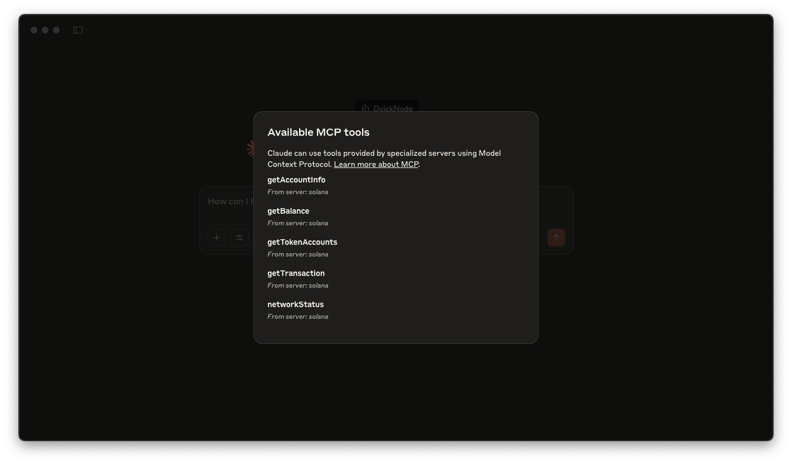

# Solana MCP Example
Example Code from [Guide: How to Build a Solana MCP Server for LLM Integration](https://www.quicknode.com/guides/ai/solana-mcp-server)

## Overview
The [Model Context Protocol (MCP)](https://modelcontextprotocol.io/introduction) allows you to extend AI assistants like Claude with custom tools that interact with external data sources and services. In this guide, you'll build a Solana MCP server that gives tools like Claude Desktop (or Cursor) the ability to query the Solana blockchain directly. This integration will enable Claude to perform tasks like checking wallet balances, viewing token accounts, retrieving transaction details, and analyzing account information—all while you maintain control over these interactions.



The demo uses:
- [Solana Kit](https://www.quicknode.com/guides/solana-development/tooling/web3-2/transfer-sol)
- [MCP TypeScript SDK](https://www.npmjs.com/package/@modelcontextprotocol/sdk)

Supporting resources:
- [Guide: How to Build a Solana MCP Server for LLM Integration](https://www.quicknode.com/guides/ai/solana-mcp-server)

## Getting Started

### Install Dependencies

Open the project dictory: 

```bash
cd AI/solana-mcp
```
Then, install the dependencies:

```bash
npm install
# or
yarn
# or
pnpm install
# or
bun install
```
### Build the Server:

Then, build the server:

```bash
npm run build
# or
yarn build
# or
pnpm build
# or
bun build
```

### Setup Claude Desktop

Update your `claude_desktop_config.json` file with the content from [example Claude desktop config](./claude_desktop_config.json). You can find instructions [here](https://www.quicknode.com/guides/ai/solana-mcp-server#setup-claude-desktop).

Make sure to update `SOLANA_RPC_ENDPOINT` with your Quicknode RPC endpoint. You can get one free [here](https://www.quicknode.com/signup?utm_source=internal&utm_campaign=dapp-examples&utm_content=solana-mcp).

Make sure your `args` pass in the absolute path to the built server (for us it is `/YOUR_PATH/build/index.js`).

Relaunch Claude Desktop after setting up your config file.

Now you can prompt Claude with commands like:

- What is the Wallet balance of `<wallet_address>`?
- What is the token balance of `<wallet_address>`?
- What's the status of the Solana network?
