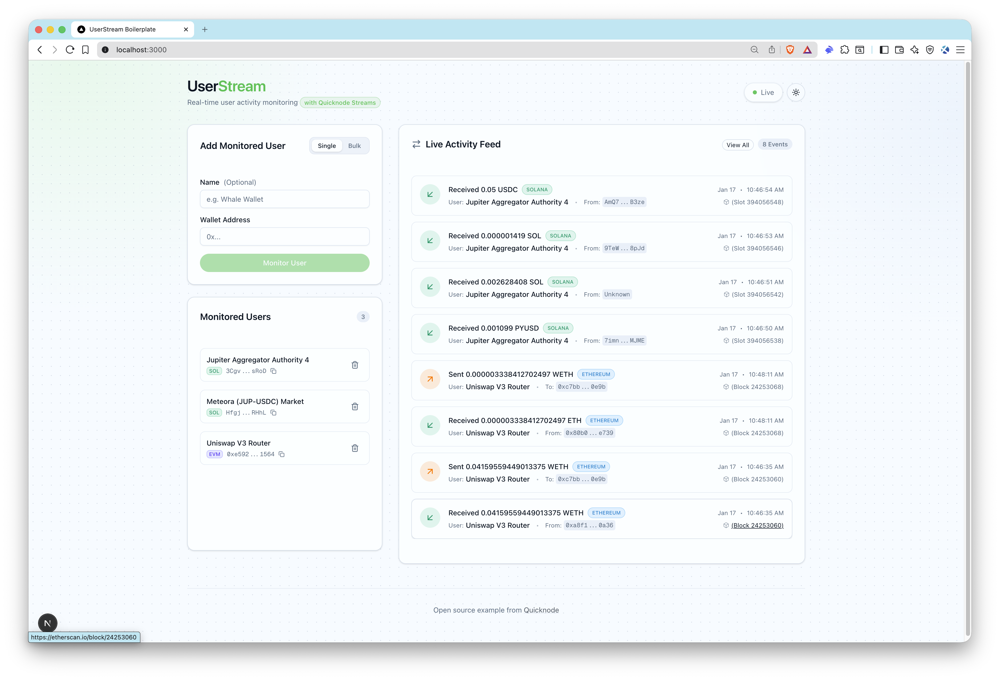

# UserStream

UserStream is a production-ready Next.js app that tracks **EVM and Solana** wallet activity in real time using **[Quicknode Streams](https://www.quicknode.com/streams)** with **intelligent, real-time filtering powered by [Quicknode KV Store](https://www.quicknode.com/docs/key-value-store)**.

## Features

### **1. Real-Time Address Filtering**
Add or remove wallet addresses through the UI (single or bulk import), and the **[Quicknode Streams](https://www.quicknode.com/streams)** filter updates **instantly** via **[KV Store](https://www.quicknode.com/docs/key-value-store)** lists. No stream restart required - start monitoring an address and see their transactions immediately.

### **2. Multi-Chain Support**
Track both **EVM** (Ethereum, Base, Arbitrum, etc.) and **Solana** wallets with dedicated filters for each chain. Native transfers, ERC-20 tokens, and SPL tokens are all supported.

### **3. Blockchain-Native Filtering**
Filtering EVM and Solana blocks happens **at the stream level** using **[Quicknode Streams Filter](https://www.quicknode.com/docs/streams/filters)** and **[Quicknode KV](https://www.quicknode.com/docs/key-value-store)** lists, not in your application code. This means you only process the exact data you need - no wasted bandwidth or compute on irrelevant transactions.

### **4. Real-Time UI Updates**
Live activity feed with transaction details powered by Server-Sent Events (SSE) - see new transactions appear instantly without polling.

### **5. Complete Setup Automation**
Pre-built scripts for **[Quicknode Streams](https://www.quicknode.com/streams)** setup and activation, plus Prisma migrations - get up and running in minutes.



## Architecture

```
Blockchain (EVM/Solana)
  -> Quicknode Streams + KV
    -> POST /api/webhook/streams (signature verified)
      -> DB insert + SSE emit
        -> Live UI activity feed
```

## Prerequisites

- **Node.js 20+** and a package manager (pnpm/npm/yarn)
- **[Quicknode account](https://www.quicknode.com/signup)** with API key that has **Streams + KV access**
- **Public webhook URL** for local development (use [ngrok](https://ngrok.com) or similar tunneling service)
- **Git** for cloning the repository

**Optional but highly recommended** (for enhanced metadata):
- Ethereum mainnet RPC URL from [Quicknode](https://www.quicknode.com/signup) (for ENS resolution and ERC-20 metadata)
- Solana RPC URL from [Quicknode](https://www.quicknode.com/signup) (for SPL token metadata)

## Environment Variables

| Variable | Required | Description | Where to Get |
|----------|----------|-------------|--------------|
| `QN_API_KEY` | **Yes** | Quicknode API key with Streams + KV access | [Quicknode Dashboard](https://dashboard.quicknode.com/api-keys) |
| `APP_URL` | **Yes** | Public webhook URL (must be reachable by Quicknode) | Use ngrok for local dev (see setup below) |
| `QN_STREAM_SECURITY_TOKEN_EVM` | For EVM | EVM stream security token | Generated by `pnpm run setup:streams` |
| `QN_STREAM_SECURITY_TOKEN_SOL` | For Solana | Solana stream security token | Generated by `pnpm run setup:streams chain=solana-mainnet` |
| `DATABASE_URL` | **Yes** | SQLite database path | `file:./dev.db` (default) |
| `QN_EVM_ENDPOINT` | No | Ethereum RPC for ENS/ERC-20 metadata | [Quicknode Endpoints](https://www.quicknode.com/signup) |
| `QN_SOLANA_ENDPOINT` | No | Solana RPC for SPL token metadata | [Quicknode Endpoints](https://www.quicknode.com/signup) |

**Important Notes:**
- **Never commit `.env` to git** - it contains sensitive credentials
- `QN_API_KEY` must have both Streams and KV permissions enabled
- `APP_URL` must be set **before** running `setup:streams` (it becomes the webhook destination)

## Quickstart

### Step 1: Clone the Repo

```bash
git clone https://github.com/quiknode-labs/qn-guide-examples.git
cd qn-guide-examples/Streams/userstream
```

### Step 2: Install Dependencies

```bash
# Using pnpm
pnpm install

# OR using npm
npm install

# OR using yarn
yarn install
```

### Step 3: Set Up Environment Variables

```bash
cp .env.example .env
```

**IMPORTANT:** Edit `.env` file **NOW** before proceeding. You must configure:

1. **`QN_API_KEY`**: Get from [Quicknode Dashboard](https://dashboard.quicknode.com/api-keys)
   - Ensure your API key has **Streams** and **KV** permissions enabled

2. **`APP_URL`**: Your public webhook URL (required for stream setup)
   - This URL must be publicly accessible by Quicknode
   - For local development, set up ngrok:

3. **`QN_EVM_ENDPOINT`** (optional but recommended): Ethereum RPC endpoint for ENS resolution and ERC-20 token metadata

4. **`QN_SOLANA_ENDPOINT`** (optional but recommended): Solana RPC endpoint for SPL token metadata

For local development, set up ngrok:

```bash
# Install ngrok (macOS)
brew install ngrok

# OR download from https://ngrok.com/download

# Start ngrok tunnel pointing to port 3000
ngrok http 3000
```

Copy the **https://** URL from ngrok output (e.g., `https://abc123.ngrok-free.app`) and add it to your `.env` file:

```bash
APP_URL="https://abc123.ngrok-free.app"
```

> **Tip:** Keep ngrok running in a separate terminal. The URL remains valid as long as ngrok is running.

### Step 4: Initialize Database

```bash
# Using pnpm
pnpm prisma migrate dev --name init

# OR using npm
npx prisma migrate dev --name init

# OR using yarn
yarn prisma migrate dev --name init
```

### Step 5: Create Quicknode Stream

#### EVM Stream

```bash
# Using pnpm
pnpm run setup:streams

# OR using npm
npm run setup:streams

# OR using yarn
yarn run setup:streams
```

This script will:
1. Create KV list for address filtering (`userstream_monitored_users_evm`)
2. Test the filter on a known block
3. Create a paused stream with your `APP_URL` as the destination
4. Print a `QN_STREAM_SECURITY_TOKEN_EVM`

**Copy the security token** from the output and add it to your `.env` file:

```bash
QN_STREAM_SECURITY_TOKEN_EVM="qnsec_..."
```

#### Solana Stream

If you want Solana, run the command again with mainnet or devnet selected:

```bash
pnpm run setup:streams chain=solana-mainnet
```

This script will:
1. Create KV list for address filtering (`userstream_monitored_users_sol`)
2. Test the filter on a known block
3. Create a paused stream with your `APP_URL` as the destination
4. Print a `QN_STREAM_SECURITY_TOKEN_SOL`

**Copy the security token** from the output and add it to your `.env` file:

```bash
QN_STREAM_SECURITY_TOKEN_SOL="qnsec_..."
```

### Step 6: Start the Application

Start the Next.js development server in a new terminal: (At this point, ngrok should still be running)

```bash
# Using pnpm
pnpm dev

# OR using npm
npm run dev

# OR using yarn
yarn dev
```

### Step 7: Activate the Stream

```bash
# Activate the most recently created stream
pnpm run activate:streams

# OR using npm
npm run activate:streams

# OR using yarn
yarn run activate:streams
```

To activate a specific chain's stream:

```bash
pnpm run activate:streams chain=ethereum-mainnet
pnpm run activate:streams chain=solana-mainnet
```

### Step 8: Add Addresses and Watch Activity

1. Open [http://localhost:3000](http://localhost:3000)
2. Add wallet addresses using the "Add Monitored Address" form, **or** use bulk import
3. Activity from monitored addresses will start flowing to your webhook in real-time


**When you add an address:**
- The address is immediately added to the **[KV Store](https://www.quicknode.com/docs/key-value-store)** list
- The **[Quicknode Stream](https://www.quicknode.com/streams)** filter picks it up instantly - no restart needed
- Transactions from this address will start flowing to your webhook in real-time

**Sample Ethereum addresses to try:**

```
0xE592427A0AEce92De3Edee1F18E0157C05861564, Uniswap V3 Router
```

**Sample Solana addresses to try:**

```
3CgvbiM3op4vjrrjH2zcrQUwsqh5veNVRjFCB9N6sRoD, Jupiter Aggregator Authority 4
```

Once configured, transactions matching your filters will stream in real-time!

> **Note:** The default setup uses Ethereum mainnet. The same EVM filter works for other EVM chains (Base, Arbitrum, Polygon, etc.) - just specify the chain and an appropriate test block number when running `setup:streams` and set up your `QN_EVM_ENDPOINT` accordingly.

## Quicknode Streams Setup

Learn more about **[Quicknode Streams](https://www.quicknode.com/streams)** and **[KV Store](https://www.quicknode.com/docs/key-value-store)** in the official documentation.

The filters are provided in the `filters/` directory:
- `filters/evm-filter.js` - EVM filter for native ETH and ERC-20 transfers
- `filters/solana-filter.js` - Solana filter for native SOL and SPL token transfers

When you run `pnpm run setup:streams`, it will:
- Create **[KV list](https://www.quicknode.com/docs/key-value-store)**: `userstream_monitored_users_evm` or `userstream_monitored_users_sol`
- Test the filter on a known block
- Create a stream (paused) and print the security token

You can override options with `key=value` arguments:

```bash
pnpm run setup:streams chain=ethereum-mainnet name="UserStream EVM Monitor" test_block_number=24223192
pnpm run setup:streams chain=solana-mainnet name="UserStream Solana Monitor" test_block_number=393612994
```

Activate the most recently created stream:

```bash
pnpm run activate:streams
```

For more details, see the **[Quicknode Streams Documentation](https://www.quicknode.com/docs/streams)**.

## Database

SQLite is used by default. Prisma schema lives in `prisma/schema.prisma`.

Common commands:

```bash
pnpm prisma migrate dev --name init
pnpm prisma studio
pnpm db:reset
```

## Webhook Security and Payload

Webhook endpoint: `POST /api/webhook/streams`

Required headers:
- `x-qn-nonce`
- `x-qn-timestamp`
- `x-qn-signature`

The request can be gzip-compressed. The handler auto-detects `content-encoding: gzip`.

Signature verification uses `QN_STREAM_SECURITY_TOKEN_EVM` or `QN_STREAM_SECURITY_TOKEN_SOL` depending on the chain.

## API Endpoints

- `GET /api/health` - health check
- `GET /api/users` - list monitored addresses
- `POST /api/users` - add address (`walletAddress`, optional `name`)
- `PATCH /api/users?id=...` - update address name/displayName
- `DELETE /api/users?id=...` - remove address
- `POST /api/users/bulk` - bulk add (newline-separated, supports "address, label")
- `POST /api/webhook/streams` - Quicknode Streams webhook
- `POST /api/webhook/test` - local-only webhook test
- `GET /api/sse` - Server-Sent Events stream of activity events

## Project Structure

```
filters/
  evm-filter.js              # EVM Streams filter
  solana-filter.js           # Solana Streams filter
scripts/
  setup-streams.ts           # Creates KV lists + stream
  activate-streams.ts        # Activates stream by id
  reset-kv.ts                # Deletes KV lists
prisma/
  schema.prisma              # SQLite schema
src/
  app/                       # App Router routes + pages
  components/                # UI components
  lib/                       # Quicknode, webhook, SSE helpers
  types/                     # Shared types
```

## Scripts

```bash
pnpm dev                    # Start development server
pnpm build                  # Build for production
pnpm start                  # Start production server
pnpm lint                   # Run ESLint
pnpm typecheck              # Run TypeScript type checking
pnpm test                   # Run tests
pnpm run setup:streams      # Create Quicknode Stream + KV lists
pnpm run activate:streams   # Activate the stream
pnpm db:reset               # Reset database
pnpm reset:kv               # Delete KV lists
```

## Testing

Unit tests use Vitest. Webhook and SSE routes have dedicated tests under `src/app/api/__tests__`.

```bash
pnpm test
```

## Troubleshooting

### Common Issues

**Missing webhook events:**
- Ensure `APP_URL` is publicly reachable and the stream is active
- Check that ngrok is still running (URLs expire when ngrok stops)
- Verify stream status in [Quicknode Dashboard](https://dashboard.quicknode.com)
- Check logs: `pnpm run activate:streams` should show stream as "running"

**401 Unauthorized from webhook:**
- Verify `QN_STREAM_SECURITY_TOKEN_EVM` or `QN_STREAM_SECURITY_TOKEN_SOL` matches the token from setup output
- Check Quicknode signature headers are present (`x-qn-signature`, `x-qn-timestamp`, `x-qn-nonce`)
- Ensure you haven't modified the webhook URL after stream creation

**KV list errors:**
- Confirm `QN_API_KEY` has **both** Streams and KV access enabled
- Check your [Quicknode Dashboard API Keys](https://dashboard.quicknode.com/api-keys) for permissions
- Verify KV lists exist: `userstream_monitored_users_evm` or `userstream_monitored_users_sol`

**ENS resolution issues:**
- Confirm `QN_EVM_ENDPOINT` points to Ethereum mainnet
- Get an Ethereum endpoint from [Quicknode](https://www.quicknode.com)
- ENS resolution is optional - addresses will work without it

**SPL token metadata missing:**
- Confirm `QN_SOLANA_ENDPOINT` points to a Solana RPC endpoint
- Get a Solana endpoint from [Quicknode](https://www.quicknode.com)
- SPL metadata is optional - transfers will still be tracked

**Address not being tracked:**
- For EVM: addresses are normalized to lowercase - this is handled automatically
- For Solana: addresses are case-sensitive (Base58 format) - ensure exact match
- Verify the address was added to the KV list via the UI

### Getting Help

- **[Quicknode Streams Guides](https://www.quicknode.com/guides/tags/streams)**
- **[Quicknode KV Store Docs](https://www.quicknode.com/docs/key-value-store)**
- **[Quicknode Support](http://support.quicknode.com/)**
- **GitHub Issues** for this repository

## License

MIT
