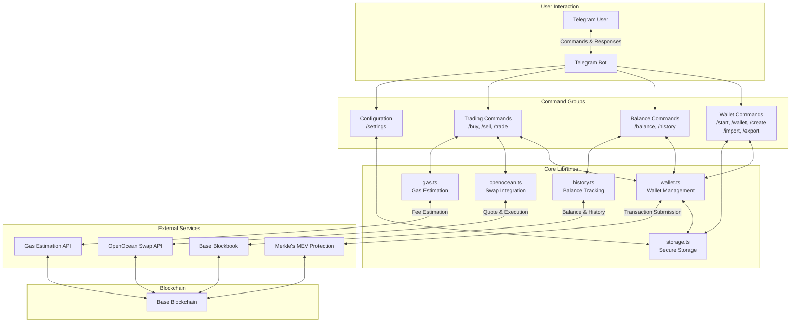

# Base MEV-Protected Telegram Trading Bot

A secure and user-friendly Telegram bot for trading ERC-20 tokens on Base Mainnet with MEV protection, leveraging QuickNode's [Base DeFi Power Bundle](https://marketplace.quicknode.com/bundles/basebundle).

## Features

- 🔐 **Secure Wallet Management**:
  - Create new wallets directly from Telegram
  - Import existing wallets using private keys
  - Encrypted storage of private keys
  - Export option with security confirmations

- 💰 **Balance & History**:
  - Display ETH and ERC-20 token balances
  - Track balance history with tables
  - View monthly, weekly, or daily history

- 💱 **Trading Functionality**:
  - Buy tokens with ETH
  - Sell tokens for ETH
  - MEV-protected transactions
  - Gas cost estimates and optimization

- 📤 **Transfer Features**:
  - Deposit ETH to your wallet
  - Withdraw ETH to any address

- ⚙️ **Customizable Settings**:
  - Adjustable slippage tolerance
  - Gas priority selection (low/medium/high)

## Technology Stack

- **Language**: TypeScript
- **Bot Framework**: [grammY](https://grammy.dev/)
- **EVM Toolkit**: [viem](https://viem.sh/)
- **Database**: SQLite via better-sqlite3
- **Integrations**:
  - [QuickNode Base DeFi Power Bundle](https://marketplace.quicknode.com/bundles/basebundle)
    - OpenOcean API for swaps
    - Sentio Gas Price API for gas estimates
    - MEV Protection & Gas Recovery for MEV-protected transactions
    - Base Blockbook JSON-RPC for fetching historical data and transactions

## Architecture



## Getting Started

### Prerequisites

- Node.js 20.x or higher
- QuickNode Base Mainnet Endpoint URL with the Base DeFi Power Bundle enabled
- Telegram Bot token (get from @BotFather)

### Installation

1. Clone the repository

```bash
git clone https://github.com/quiknode-labs/qn-guide-examples.git
cd qn-guide-examples/base/telegram-trading-bot
```

2. Install dependencies:

```bash
npm install
# or
yarn install
# or
pnpm install
# or
bun install
```

3. Create a `.env` file based on the example:

```bash
cp .env.example .env
```

4. Get a Telegram Bot Token

    - Open Telegram and search for the BotFather (@BotFather)
    - Send the command `/newbot`
    - Follow the instructions to name your bot
    - Keep the token provided by BotFather handy

5. Get a QuickNode Base Mainnet Endpoint URL

    - [Sign up](https://quicknode.com/signup) for a QuickNode account
    - Create a Base Mainnet endpoint
    - Activate the Base DeFi Power Bundle for your endpoint
    - Keep the endpoint URL handy

6. Create a wallet encryption key to encrypt your private keys

```bash
openssl rand -base64 32
```

7. Fill in your environment variables in the `.env` file:

```bash
TELEGRAM_BOT_TOKEN=your_telegram_bot_token
QUICKNODE_RPC=your_quicknode_endpoint
WALLET_ENCRYPTION_KEY=random_32_char_string
DB_PATH=path_to_sqlite_db (default: ./db.sqlite)
CHAIN_ID=base_mainnet_chain_id (default: 8453)
DEFAULT_SLIPPAGE=default_slippage_tolerance (default: 1)
DEFAULT_GAS_PRIORITY=default_gas_priority (default: medium)
```

### Running the Bot

For development:
```bash
npm run dev
```

For production:
```bash
npm run start
``` 

### Troubleshooting Common Issues

If you encounter the following error when starting the bot:
```bash
Error: Could not locate the bindings file. Tried:
```

This indicates that `better-sqlite3` native bindings failed to build correctly, often due to mismatched Node.js versions or incomplete dependency compilation.

#### Recommended Fix: Manual Rebuild
Rebuild the native bindings from source:

```bash
cd node_modules/better-sqlite3
npm run build-release
# or
pnpm run build-release
ls build  # Verify that a .node file (e.g., better_sqlite3.node) appears
cd ../..
```

This command compiles the bindings for your system’s Node.js version, resolving the error.

#### Alternative Fixes:

**Clean and Reinstall Dependencies:** If the rebuild fails, clear the `node_modules` directory and reinstall:

```bash
rm -rf node_modules package-lock.json
npm install

# Or, if using pnpm:
rm -rf node_modules pnpm-lock.yaml
pnpm install
```

**Check Node.js Version**: Ensure you’re using Node.js 20.x or higher, as better-sqlite3 may not support older versions.

## Usage

### Basic Commands

- `/start` - Initialize the bot and register
- `/help` - Show all available commands
- `/wallet` - Display wallet information
- `/balance` - Show token balances
- `/history` - Display balance history
- `/help` - Show all available commands

### Wallet Management

- `/create` - Create a new wallet
- `/import` - Import an existing wallet via private key
- `/export` - Export your private key (with security confirmation)

### Trading

- `/buy` - Buy tokens with ETH
- `/sell` - Sell tokens for ETH
- `/settings` - Configure trading parameters

### Transfers

- `/deposit` - Show your wallet address for deposits
- `/withdraw` - Withdraw ETH to another address

## Security Considerations

- Private keys are encrypted using AES-256 before storage
- Sensitive operations require confirmation
- All transactions use MEV protection to prevent front-running

## Disclaimer

This software is provided for educational and demonstration purposes only. Use at your own risk. Always verify transactions and conduct proper security reviews before using in production environments.