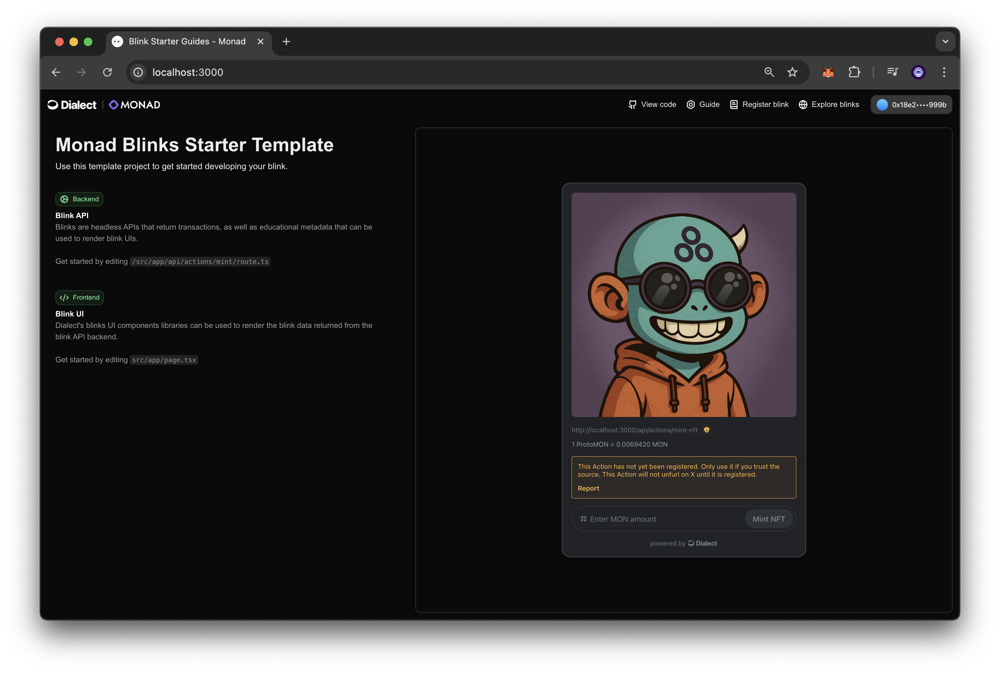
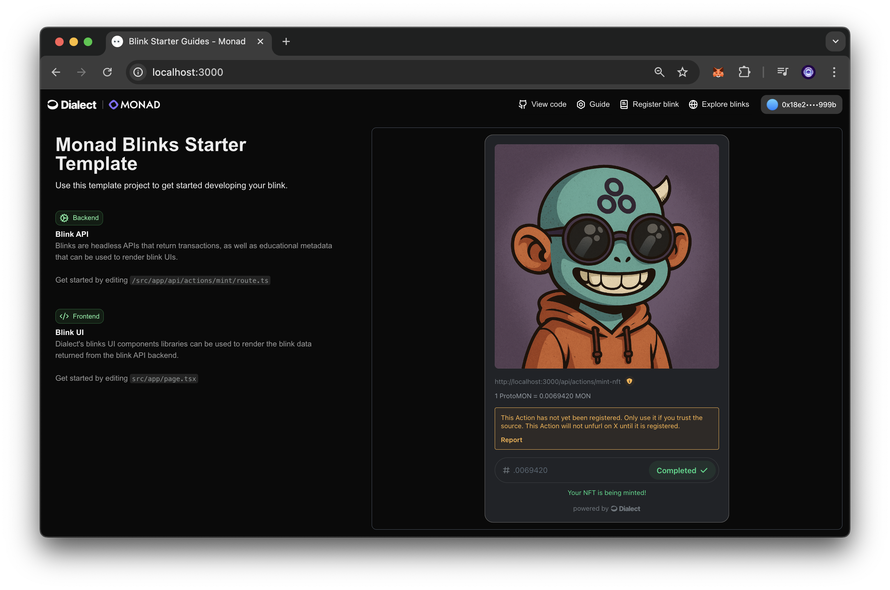

# Blinks NFT Minter for Monad

A Next.js-based starter template demonstrating how to create NFT Blinks on the Monad blockchain. This project showcases an NFT minting interface that allows users to mint NFTs with a simple, shareable link.


## What are Blinks?

Blinks (Blockchain Links) are shareable URLs that bundle on-chain actions into a single, clickable link. They eliminate the need for complex integrations, allowing developers to embed blockchain interactions anywhere URLs are supported.

## Prerequisites

- Node.js and Git installed
- A wallet (MetaMask or WalletConnect compatible) with testnet MON tokens
- An ERC-721 compatible NFT contract deployed on Monad testnet
- QuickNode endpoint for Monad testnet 

## Getting Started

1. Clone the repository:

```bash
git clone https://github.com/quiknode-labs/qn-guide-examples.git
```

2. Install dependencies:

```bash
cd ethereum/blink-starter-monad && npm install
```

3. Update the `.env` file with your QuickNode Monad testnet endpoint:

```
MONAD_ENDPOINT_URL=https://api.quicknode.com/YOUR-KEY
```

4. Update the contract address and mint price in `src/app/actions/mint-nft/route.ts`:

```typescript
const NFT_CONTRACT_ADDRESS = "YOUR_NFT_ADDRESS"; // Input your NFT contract address
const MINT_PRICE_ETH = "YOUR_NFT_MINT_PRICE"; // Price per NFT in MON (adjust as configured by your smart contract)
```

5. Run the development server:

```bash
npm run dev
```

6. Open [http://localhost:3000](http://localhost:3000) with your browser to see the application.





## Key Components

- **GET Endpoint**: Defines the UI for the Blink (icon, title, description, available actions)
- **POST Endpoint**: Contains the logic for transaction generation based on user input
- **Gas Estimation**: Helper function to check network gas fees and recommend appropriate values
- **NFT Contract Interface**: ABI definition for interacting with your NFT contract

## Register Your Blink

To make your Blink available to others, register it on [Dialect](https://terminal.dial.to/).

## Additional Resources

- [Monad Official Website](https://www.monad.xyz/)
- [Blinks Documentation](https://docs.dialect.to/blinks/)
- [QuickNode Multi-Chain Faucet](https://faucet.quicknode.com/drip)
- [How to Create and Deploy an ERC-721 NFT](https://www.quicknode.com/guides/ethereum-development/nfts/how-to-create-and-deploy-an-erc-721-nft)
