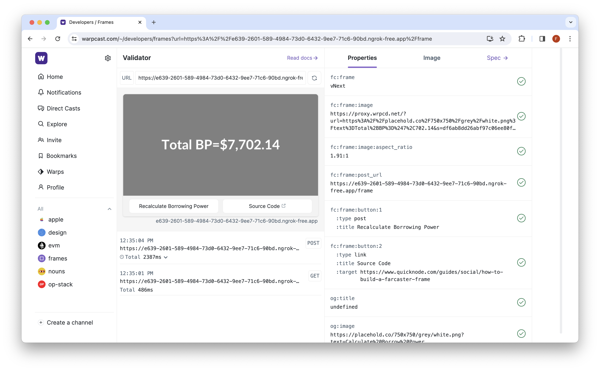

# Project Name

## Overview

This project is based on this QuickNode guide: https://www.quicknode.com/guides/social/how-to-build-a-farcaster-frame

## Prerequisites

Before you start, make sure you have the following installed and set up:

- **Ethereum Mainnet Node Endpoint**: An endpoint is required for interacting with the Ethereum mainnet. Sign up for an endpoint [here](https://www.quicknode.com/signup?utm_source=internal&utm_campaign=guides&utm_content=what-is-farcaster-and-how-to-build-farcaster-frames).
- **Optimism Mainnet Node Endpoint**: Only necessary if you're running a Hubble node.
- **Node.js**: installed v18.14>
- **Neynar API (optional)**: Alternatively, you can gain access to read/write operations with the Farcaster network through an API provider such as [Neynar](https://neynar.com/).
- **Farcaster Account**: An account on [Farcaster](https://warpcast.com/~/invite-page/214507?id=28cf29bb) is necessary if you want to post (cast) your Frame

## Getting Started

1. Start by cloning this repository to your local machine.

```
git clone git@github.com:quiknode-labs/qn-guide-examples.git
```

2. Navigate to the appropriate directory and install the required dependencies.

```
cd ethereum/farcaster-frames
npm install
```

3. Rename **.env.example** to **.env** and update the values accordingly

4. If you're running a Hubble node, make sure to expose your port via a remote url (e.g., ngrok). Otherwise, if you're using Neynar, ensure you commented out the Hubble logic in `src/ethers.ts` and uncomment the Neynar API logic.

5. Once everything is set up, you can start the project by running:

```
npm run dev
```

> This will start a local server at PORT 8080

6. Next, start a ngrok server with the command `ngrok http 8080` and update the value in **.env** (`NGROK_URL`) accordingly. You may need to restart the local server.

7. Test the frame via the Warpcast Frame validator [tool](https://warpcast.com/~/developers/frames). You will need to add `/frame` to the end of your ngrok URL (e.g. `https://0289-2601-589-4984-73d0-6432-9ee7-71c6-90bd.ngrok-free.app/frame`)




## Contributing

We welcome contributions! If you're interested in helping improve this project, please open a PR.

For any questions or support, please open an issue, and we'll get back to you as soon as possible.
