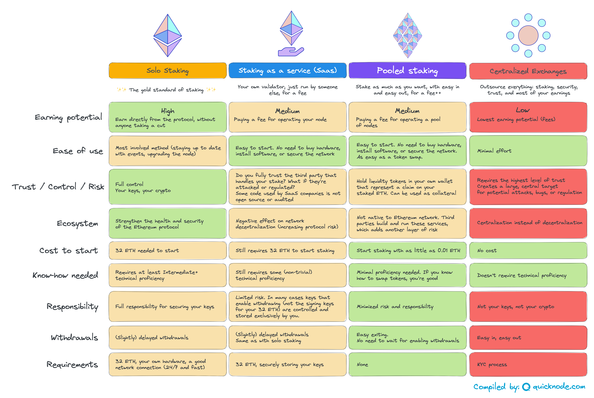

# Ethereum Staking Options

## Video with a high level overview of staking options:

## Staking Options

SVG version: [ethereum-staking-options.svg](ethereum-staking-options.svg)

## Examples and recommendations for each option:

### Option 1: Solo staking

A full video tutorial on how to solo stake will be coming next week.

### Option 2: Staking with a Staking Service Provider

[Kiln](https://www.kiln.fi/)

[BloxStaking](https://bloxstaking.com/)

[Figment](https://www.figment.io/staking-ethereum) for institutional staking

### Option 3: Staking with a pool (a.k.a liquid staking)

[Rocket Pool](https://rocketpool.net/)

[Lido](https://lido.fi/)

[Stakewise](https://stakewise.io/)

### Option 4: Staking with centralized exchanges

[Coinbase](https://www.coinbase.com/earn)

[Binance](https://www.binance.com/en/defi-staking)
