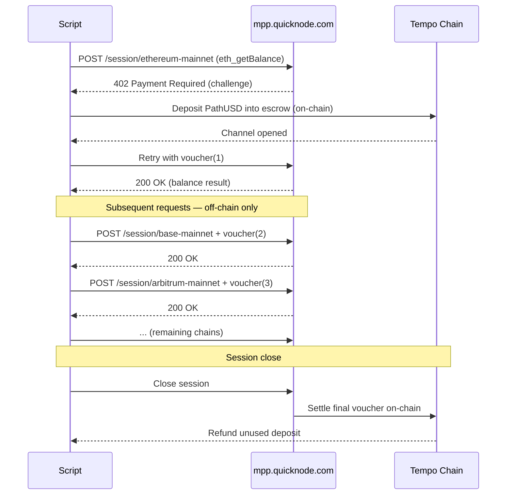

# Multichain Balance Checker (via MPP Sessions)

A demo script that illustrates [MPP](https://mpp.dev) sessions in action. It opens a single payment channel through `mpp.quicknode.com`, queries native token balances (`eth_getBalance`) across 15 EVM chains using off-chain vouchers, and outputs a formatted balance report with a cost breakdown.

## Why Sessions?

With a **charge** (one-time payment), every request settles on-chain individually. That works for occasional calls, but for a script that fires dozens of RPC requests across multiple networks in one run, the per-request on-chain overhead adds up fast.

**Sessions** solve this by opening a single payment channel up front. The client deposits funds into escrow once, then signs off-chain vouchers for each subsequent request — no blockchain round-trip needed. This gives you:

- **Near-zero latency** — voucher verification is a CPU-bound signature check, not a network transaction
- **Scalable throughput** — the bottleneck is server CPU, not blockchain consensus
- **Built-in refunds** — unused deposit is automatically returned when the session closes

For a multichain balance checker making 15+ calls in a single run, sessions are the natural fit. See the [MPP session docs](https://mpp.dev/payment-methods/tempo/session) for the full protocol details.

## Session Flow



## Prerequisites

- Node.js 20+
- Basic familiarity with EVM chains

No [Quicknode](https://quicknode.com/) account or API keys required — MPP handles access and billing via payment channels.

## Quick Start

```bash
# Install dependencies
npm install

# Run with an auto-generated testnet wallet (zero setup)
npx tsx index.ts

# Or provide your own private key via a .env file
echo "MPPX_PRIVATE_KEY=0x..." > .env
npx tsx --env-file=.env index.ts
```

When run without `MPPX_PRIVATE_KEY`, the script generates a fresh wallet and funds it automatically via the Tempo testnet faucet.

> **Note:** Never pass private keys directly on the command line. Use a `.env` file and make sure it's listed in your `.gitignore`.


## Configuration

Edit the constants at the top of `index.ts`:

```typescript
const WALLET_ADDRESS = '0xd8dA6BF26964aF9D7eEd9e03E53415D37aA96045' // address to check
const MAX_DEPOSIT = '1' // PathUSD locked into the session channel
```

## Supported Chains

Ethereum, Base, Arbitrum, Optimism, Polygon, World Chain, BNB Chain, Fantom, Celo, Gnosis, zkSync Era, Scroll, Linea, Mantle, Blast

The chain list is a constant in `index.ts` — add or remove entries as needed. You can use any chain [Quicknode supports](https://www.quicknode.com/docs/platform/supported-chains-node-types#supported-chains--networks) for MPP sessions. See the [MPP protocol reference](https://mpp.quicknode.com/llms.txt) for the supported networks and their slugs.

The chains you query are **decoupled from the payment network**. Your session runs on the Tempo blockchain (testnet or mainnet), but it can access RPC endpoints on any supported chain. This means you can query Ethereum mainnet, Base, Arbitrum, etc. regardless of whether your session is funded with testnet or mainnet PathUSD.

> **Testnet limits:** Tempo testnet wallets have a lifetime cap of 10K requests. For unlimited usage, switch to Tempo mainnet (see [Going to Production](#going-to-production)).

You can easily adapt this script to call any RPC method on any MPP-supported chain — just change the request payload and the network slug in the `session.fetch()` calls.

## Example Output

```
Multichain Balance Checker (via MPP Session)
━━━━━━━━━━━━━━━━━━━━━━━━━━━━━━━━━━━━━━━━━━━━━━━━━━━━━━━━

Wallet:  0x1234...abcd (auto-generated)
Target:  0xd8dA...6045

 Chain            | Balance               | Status
──────────────────┼───────────────────────┼──────────
 Ethereum         | 1.2345 ETH            | ok
 Base             | 0.5000 ETH            | ok
 Polygon          | 150.0000 POL          | ok
 ...              | ...                   | ...

━━━━━━━━━━━━━━━━━━━━━━━━━━━━━━━━━━━━━━━━━━━━━━━━━━━━━━━━
 Session Summary
━━━━━━━━━━━━━━━━━━━━━━━━━━━━━━━━━━━━━━━━━━━━━━━━━━━━━━━━
 Chains queried:    15 (15 ok, 0 errors)
 Total RPC calls:   15
 Session cost:      0.000150 PathUSD ($0.00015)
 Channel deposit:   1.000000 PathUSD
 Refunded:          0.999850 PathUSD
```

## How It Works

1. **Wallet setup** — Uses a provided private key or generates a new one. Auto-generated wallets are funded via the Tempo testnet faucet.
2. **Session open** — Creates an MPP session via `tempo.session()` with a `maxDeposit` of 1 PathUSD. The first request opens a payment channel on-chain.
3. **Balance queries** — Iterates through each chain, sending `eth_getBalance` via `session.fetch()` to `mpp.quicknode.com/session/{network-slug}`. After the first request, all subsequent requests use off-chain vouchers (instant, no gas).
4. **Session close** — Settles the channel on-chain. Unused deposit is refunded.

## Dependencies

| Package | Purpose |
|---------|---------|
| `mppx`  | MPP protocol client (session management, voucher signing) |
| `viem`  | Wallet operations and balance formatting |
| `tsx`   | Run TypeScript directly (dev dependency) |

## Going to Production

- **Testnet** (default): Uses PathUSD on Tempo Moderato (chain ID 42431). Lifetime cap of 10K requests per wallet.
- **Mainnet**: Accepts PathUSD or USDC.e on Tempo mainnet (chain ID 4217). No cap. Switch by providing a mainnet-funded wallet key.

## Resources

- [Quicknode - MPP Payments](https://www.quicknode.com/docs/build-with-ai/mpp-payments)
- [MPP Documentation](https://mpp.dev)
- [mppx SDK](https://www.npmjs.com/package/mppx)
- [Quicknode - MPP Protocol Reference](https://mpp.quicknode.com/llms.txt)
