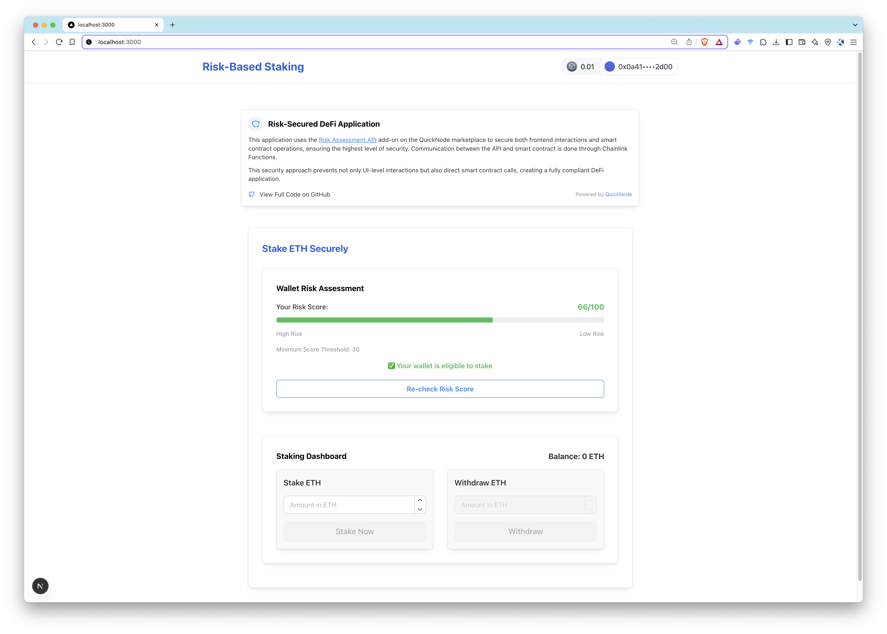
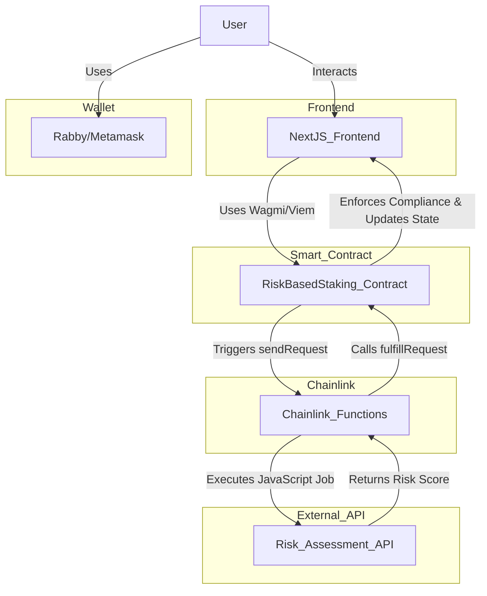

# AML and CFT Compliant dApp



**AML and CFT Compliant dApp** is a decentralized application (dApp) built on Ethereum-compatible networks (e.g., Base mainnet) that enables secure ETH staking with a compliance layer powered by [Chainlink Functions](https://chain.link/functions) and the [Risk Assessment API](https://marketplace.quicknode.com/add-on/risk-assessment-api?utm_source=internal&utm_campaign=sample-apps&utm_content=aml-and-cft-compliant-dapp) which is on the [QuickNode Marketplace](https://marketplace.quicknode.com/?utm_source=internal&utm_campaign=sample-apps&utm_content=aml-and-cft-compliant-dapp). This project demonstrates a practical integration of off-chain data into smart contracts, ensuring only low-risk wallets can participate in the staking pool.

This project is deployed on **Base Mainnet** by default. If you choose to use a different network, make sure to update the relevant environment variables accordingly.

> We have a **[detailed step-by-step guide](https://www.quicknode.com/guides/ethereum-development/dapps/how-to-build-an-aml-and-cft-compliant-dapp?utm_source=internal&utm_campaign=sample-apps&utm_content=aml-and-cft-compliant-dapp)** that walks you through the entire setup process, including deploying the smart contract, configuring Chainlink Functions, and integrating the Risk Assessment API. If you're new to Chainlink Functions or QuickNode add-ons, this guide will help you understand the integration in more depth.

## Project Overview

The primary goal of AML and CFT Compliant dApp is to provide a secure staking experience by incorporating an on-chain compliance check. The application:

- **Accepts ETH deposits** only from wallets that pass a risk evaluation.
- **Facilitates withdrawals** after verifying wallet compliance via an oracle-provided risk score.
- **Integrates off-chain risk data** from a dedicated Risk Assessment API using Chainlink Functions.

### Technical Architecture

- **Risk Assessment API:** A QuickNode marketplace add-on that provides a numeric risk score (0-100, where higher scores indicate lower risk) based on off-chain analysis (e.g., transaction patterns, known associations).
- **Chainlink Functions:** A decentralized oracle solution that fetches data from the API, processes it, and updates the smart contract. It uses DON-hosted or user-hosted [secrets](https://docs.chain.link/chainlink-functions/resources/secrets) for API key management and a callback mechanism to deliver results.
- **Smart Contract:** A Solidity contract that enforces staking rules based on risk scores. It integrates with Chainlink Functions to request and receive risk data.
- **Next.js Frontend:** A TypeScript-based React application using Next.js, Wagmi, and Viem for blockchain interactions.

> This project implements security checks at both the smart contract and frontend levels for a fully compliant dApp. If you opt for a frontend-only security check (e.g., querying the API directly), Chainlink Functions can be bypassed, but this will disable on-chain compliance enforcement.

**Data Flow:**

1. User initiates a risk check if they don’t have a risk score yet.
2. The Next.js API (`/api/check-risk`) triggers a Chainlink Functions request with the wallet address.
3. Chainlink Functions calls the Risk Assessment API, processes the response, and returns the risk score.
4. The smart contract updates the user’s risk profile and enforces compliance.
5. The frontend reflects changes via post-action refetching and displays the user’s risk score and progress bar and allows them to stake or withdraw based on their risk score.

### Key Components

#### 1. Smart Contract: `RiskBasedStaking.sol`

This Solidity contract handles staking and withdrawal operations with an integrated risk assessment:

- **Deposit Function:** Accepts ETH deposits if the wallet’s risk score is below a set threshold.
- **Withdraw Function:** Allows users to withdraw their staked ETH, subject to compliance checks.
- **Risk Score Storage:** Records the latest risk score for each wallet (updated via a Chainlink Functions callback).
- **Configurable Threshold:** Only wallets with a risk score below a predetermined threshold (e.g., 50 out of 100) are allowed to stake.

**Technical Details:**

- **Language:** Solidity (v0.8.18)
- **State Variables:**
  - `mapping(address => uint256) public stakedBalances` – User ETH deposits.
  - `mapping(address => uint256) public riskScores` – Latest wallet risk scores.
  - `uint256 public riskThreshold` – Maximum acceptable risk score.
  - `mapping(address => bool) public pendingRequests` – Tracks ongoing risk check requests.
- **Core Functions:**
  - `stake()`: Deposits ETH if the risk score is acceptable.
  - `withdraw(uint256 amount)`: Withdraws staked ETH after validating balances.
  - `sendRequest(...)`: Owner-only function to trigger a Chainlink Functions request for risk evaluation.
  - `fulfillRequest(bytes32, bytes, bytes)`: Internal callback to update the risk score.
  - `setRiskThreshold(uint256)`: Owner-only function to modify the risk threshold.

#### 2. Chainlink Functions Integration

Chainlink Functions acts as the bridge between off-chain risk data and the on-chain staking contract:

- **Data Source:** Retrieves a wallet’s risk score from the Risk Assessment API.
- **Job Execution:** Executes a JavaScript job (via Chainlink Functions) to call the API and return a numeric risk score.
- **Callback Mechanism:** The smart contract’s `fulfillRequest` function updates the wallet’s risk profile based on the returned score.

#### 3. Risk Assessment API

The Risk Assessment API delivers real-time risk evaluations for wallet addresses:

- **Risk Scoring:** Returns a numeric score (0–100) based on off-chain analysis (e.g., transaction history, known associations).
- **Multi-Chain Compatibility:** Works with Ethereum and other EVM-based networks.

**Sample API Response:**

```json
{
  "jsonrpc": "2.0",
  "result": {
    "score": 1,
    "severity": "CRITICAL_RISK",
    "entityType": "Sanction list",
    "entityName": "Sinbad.io"
  },
  "id": 1
}
```

#### 4. Next.js Frontend

The Next.js frontend provides an intuitive interface for users to interact with the staking contract:

- **Risk Score Display:** Shows the evaluated risk score of the connected wallet.
- **Deposit Section:** Allows users to stake ETH if they meet the compliance criteria.
- **Withdrawal Section:** Enables withdrawals of staked ETH.
- **Blockchain Interaction:** Built with Next.js, TypeScript, Wagmi, Viem, and Mantine UI for a modern user experience.

## Architecture Overview



## Project Structure

### Foundry Project

The smart contract is developed and deployed using [Foundry](https://getfoundry.sh/). The directory structure is as follows:

```
├── README.md
├── foundry.toml
├── lib
│   ├── forge-std
│   └── foundry-chainlink-toolkit
├── remappings.txt
├── script
│   └── RiskBasedStaking.s.sol
├── src
│   └── RiskBasedStaking.sol
└── test
```

- **`foundry.toml`:** Foundry configuration file.
- **`lib/`:** Contains dependencies for testing and Chainlink integration.
- **`remappings.txt`:** Remappings for Foundry dependencies.
- **`script/RiskBasedStaking.s.sol`:** Foundry deployment script.
- **`src/RiskBasedStaking.sol`:** The smart contract that handles staking and withdrawal operations with an integrated risk assessment.

### Next.js Directory

The frontend is built with Next.js, leveraging modern React patterns and blockchain libraries. The structure is:

```
├── README.md
├── next.config.ts
├── package.json
├── public
├── src
│   ├── app
│   │   ├── api                         # API routes, including the Chainlink Functions integration
│   │   ├── favicon.ico
│   │   ├── globals.css
│   │   ├── layout.tsx
│   │   ├── page.module.css
│   │   └── page.tsx
│   ├── components                     # Reusable UI components (e.g., header, forms, banners)
│   │   ├── Header.tsx
│       └── HomePage.tsx
│   │   ├── InfoBanner.tsx
│   │   ├── Providers.tsx
│   │   └── StakingForm.tsx
│   ├── config                          # Wagmi/Viem configuration for wallet and contract interactions
│   │   └── wagmiConfig.ts
│   ├── hooks                           # Custom hooks for contract interactions and risk assessment
│   │   ├── useRiskCheck.ts
│   │   └── useStakingContract.ts
│   ├── lib                             # Smart contract helper functions and ABIs
│   │   └── RiskBasedStaking.ts
└── tsconfig.json
```

- **API Route:** Located in `src/app/api`, this API route leverages the [Chainlink Functions Toolkit](https://www.npmjs.com/package/@chainlink/functions-toolkit) to call Chainlink Functions.
- **Components & Hooks:** Manage UI and blockchain interactions with Mantine and Wagmi/Viem.
- **Configuration:** Centralizes wallet connectivity and contract addresses.

## Getting Started

### Prerequisites

- **Node.js** (v18+)
- **Foundry** (install with `curl -L https://foundry.paradigm.xyz | bash` then `foundryup`)
- **A Web3 Wallet:** e.g., Rabby, MetaMask
- **Base Mainnet RPC URL:** Provided by [QuickNode](https://www.quicknode.com/?utm_source=internal&utm_campaign=sample-apps&utm_content=aml-and-cft-compliant-dapp) with the Risk Assessment API enabled
- **Chainlink Functions Subscription**

## Installation

Follow these steps to set up and deploy the AML and CFT Compliant dApp project.

---

### 1. Clone the Repository  
Start by cloning the repository and navigating to the project directory:

```bash
git clone https://github.com/quiknode-labs/qn-guide-examples.git
cd qn-guide-examples/sample-dapps/aml-and-cft-compliant-dapp
```


### 2. Set Up Your QuickNode Endpoint  
Before proceeding, ensure you have a **QuickNode endpoint** with the **Risk Assessment API** enabled:

1. **Create a QuickNode Endpoint**  
   - Visit [QuickNode](https://www.quicknode.com/?utm_source=internal&utm_campaign=sample-apps&utm_content=aml-and-cft-compliant-dapp) and set up an endpoint on your preferred network.  
   - Ensure the selected network is supported by the **Risk Assessment API** (check [supported networks](https://marketplace.quicknode.com/add-on/risk-assessment-api?utm_source=internal&utm_campaign=sample-apps&utm_content=aml-and-cft-compliant-dapp)).

2. **Enable the Risk Assessment API Add-on**  
   - Go to your **QuickNode dashboard**.  
   - Navigate to your endpoint settings and enable the **Risk Assessment API** add-on.  
   - Follow any configuration instructions if required.

### 3. Configure Foundry and Smart Contract Deployment  

1. **Install Foundry**  
   If you haven’t installed Foundry, do so with:  
   ```bash
   curl -L https://foundry.paradigm.xyz | bash
   foundryup
   ```

2. **Install Dependencies**  
   Navigate to the Foundry directory and install required dependencies:
   ```bash
   cd foundry
   forge install smartcontractkit/foundry-chainlink-toolkit
   forge install foundry-rs/forge-std
   ```

3. **Create the Remappings File**
  Run the following command to add remappings for the Chainlink Toolkit and Foundry dependencies:
  ```bash
  forge remappings > remappings.txt
  ```

4. **Import Your Wallet**  
   Securely import your wallet to Foundry using:  
   ```bash
   cast wallet import your-wallet-name --interactive
   ```

  Update the `your-wallet-name` with the name of your wallet. You will be prompted to enter your **private key** and **set a password** for encryption.

   `-interactive` flag allows you to enter the private key without saving it in your shell history.

5. **Set Up Environment Variables**  
  - Copy the sample `.env` file and update it with your configuration:
    ```bash
    cp .env.sample .env
    ```
  - Open `.env` and update the following:
    ```bash
    BASE_RPC_URL=<your-base-rpc-url>
    BASESCAN_API_KEY=<your-basescan-api-key>
    ```
  - Load the variables:
    ```bash
    source .env
    ```

6. **Update Deployment Script**  
   - Modify the `router` address in the deployment script (script/RiskBasedStaking.s.sol) to the router address of the chain and network you're using.  
   - Refer to [Chainlink Functions Supported Networks](https://docs.chain.link/chainlink-functions/supported-networks) for the correct router address.

7. **Deploy the Smart Contract**  
   Deploy the contract using Foundry:
   ```bash
   forge script script/RiskBasedStaking.s.sol:RiskBasedStakingScript --rpc-url $BASE_RPC_URL --account your-wallet-name --broadcast --verify -vvv
   ```
   - Update the `your-wallet-name` with the name of your wallet. 
   - Remove `--verify` if you don't want to verify the contract.  
   - **Save the contract address**, as you will need it for Chainlink Functions and frontend configurations.

### 4. Set Up Chainlink Functions Subscription  

After deploying the smart contract, you need to set up a **Chainlink Functions subscription** to allow the contract to request risk assessments. Follow these steps:

1. **Create a Chainlink Functions Subscription**  
   - Go to the [Chainlink Functions UI](https://functions.chain.link/) for your desired network.  
   - Follow the instructions to **create a new subscription**.  
   - **Fund the subscription** with LINK tokens (you can bridge LINK if needed, see [LINK token docs](https://docs.chain.link/resources/link-token-contracts)).  

2. **Add Your Smart Contract as a Consumer**  
   - Once the subscription is set up, **add your deployed contract address** as a consumer.  
   - This allows the contract to make requests via Chainlink Functions.

3. **Check Network-Specific Details**  
   - Each network has its own **Functions router address** and **DON ID** (Decentralized Oracle Network).  
   - Refer to the [Chainlink Functions Supported Networks](https://docs.chain.link/chainlink-functions/supported-networks) page to find the correct values for your network.  

For a detailed setup guide, refer to the [Chainlink Functions Documentation](https://docs.chain.link/chainlink-functions).


### 5. Deploy the Project

1. **Install Dependencies**  

Go back to your project's root directory (i.e `aml-and-cft-compliant-dapp`), then run the following command:

```bash
cd next-app
npm install
```

2. **Set Up Environment Variables**  

  Before running the frontend, configure the required environment variables in a `.env` file inside the `next-app` directory:  

  ```dotenv
  WALLETCONNECT_PROJECT_ID=<your-walletconnect-project-id>
  PRIVATE_KEY=<your-private-key>
  QUICKNODE_ENDPOINT=<your-quicknode-endpoint>
  CONTRACT_ADDRESS=<deployed-contract-address>
  SUBSCRIPTION_ID=<chainlink-subscription-id>
  ```

- **`WALLETCONNECT_PROJECT_ID`** – Your WalletConnect project ID, required for enabling wallet connections.  
- **`PRIVATE_KEY`** – The private key of a designated wallet used to sign risk check requests.  
  - This ensures that only authorized users can trigger Chainlink Functions requests.  
  - Without this, the Chainlink subscription could be abused by unauthorized users.  
- **`QUICKNODE_ENDPOINT`** – Your QuickNode RPC endpoint URL with the **Risk Assessment API** enabled.  
- **`CONTRACT_ADDRESS`** – The deployed **Risk-Based Staking** smart contract address.  
- **`SUBSCRIPTION_ID`** – The Chainlink Functions subscription ID linked to your contract for off-chain risk evaluations.  

3. **Update Chainlink Functions Configuration**

Update the `src/app/api/check-risk/route.ts` file with the correct router address and DON ID for your chain and network.

```js
  // Chainlink Functions configuration
  const routerAddress = "0xf9B8fc078197181C841c296C876945aaa425B278";
  const donId = "fun-base-mainnet-1";
  const gatewayUrls = [
    "https://01.functions-gateway.chain.link/",
    "https://02.functions-gateway.chain.link/",
  ];
```

4. **Run the Frontend Application**  
  Start the development server:

  ```bash
  npm run dev
  ```

- Open [http://localhost:3000](http://localhost:3000) in your browser.

## Screenshots


## Usage

1. **Connect Your Wallet:**  
   Use a supported Web3 wallet (e.g., MetaMask, Rabby) to connect.

2. **Check Your Risk Score:**  
   If your wallet has not been evaluated, click the "Check Risk" button to initiate a risk evaluation via Chainlink Functions.

3. **Stake ETH:**  
   After passing the risk check, use the stake function to deposit ETH.

4. **Withdraw ETH:**  
   Withdraw your staked ETH at any time, provided your wallet remains compliant.

## Contributing

Contributions are welcome! Whether you improve the smart contract, refine the frontend, or add new features, your help is appreciated.

- **Report Issues:** Use GitHub Issues to report bugs or suggest features.
- **Submit Pull Requests:** Fork the repository, create a branch, and submit a pull request. Please follow the existing code style and include tests where applicable.
