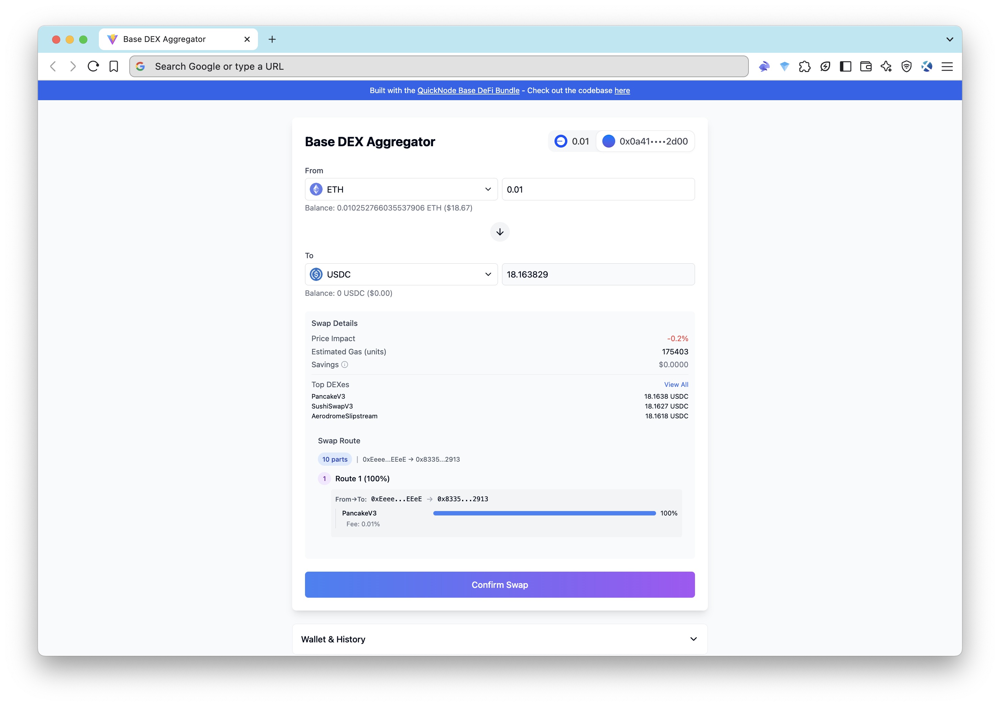

# Base DEX Aggregator App

A modern, user-friendly web application for performing token swaps on the Base blockchain. This web app uses QuickNode’s [Base DeFi Power Bundle](https://marketplace.quicknode.com/bundles/basebundle?utm_source=internal&utm_campaign=sample-apps&utm_content=base-dex-aggregator) to deliver **real-time gas estimation** and **optimized swap routing** — all in one modern interface.


 
## 🚀 Features

- 🔁 **Token Swaps**: Execute token swaps on Base using [OpenOcean v4 Swap API](https://marketplace.quicknode.com/add-on/openocean-v4-swap-api?utm_source=internal&utm_campaign=sample-apps&utm_content=base-dex-aggregator)
- ⛽ **Gas Estimation**: Real-time gas price predictions at 70%, 90%, and 99% confidence levels
- 👛 **Wallet Integration**: Easily connect wallets (MetaMask, WalletConnect, Rabby, etc.) via [connectkit](https://docs.family.co/connectkit)
 
## 🛠️ Tech Stack

| Layer     | Technology                |
| --------- | ------------------------- |
| Frontend  | React + TypeScript        |
| Web3      | Viem, Wagmi, QuickNode    |
| Wallets   | connectkit, WalletConnect |
| Styling   | Tailwind CSS              |
| API Calls | Axios                     |
| Tooling   | Vite                      |
 
## 📦 Prerequisites

Before running the app, ensure you have:

- [Node.js](https://nodejs.org/) v20.x or later
- npm, yarn, or pnpm
- A [QuickNode](https://quicknode.com/signup?utm_source=internal&utm_campaign=sample-apps&utm_content=base-dex-aggregator) Base endpoint with the **Base DeFi Power Bundle** enabled
- A [WalletConnect Project ID](https://cloud.walletconnect.com)
 
## ⚙️ Getting Started

### 1. Clone the Repository

```bash
git clone https://github.com/quiknode-labs/qn-guide-examples.git
cd qn-guide-examples/sample-dapps/base-dex-aggregator
```

### 2. Install Dependencies

```bash
npm install
# or
yarn install
# or
pnpm install
```

### 3. Configure Environment

Copy the `.env.sample` file and fill in your credentials:

```bash
cp .env.sample .env
```

```env
VITE_WALLETCONNECT_PROJECT_ID="your-walletconnect-project-id"
VITE_QUICKNODE_ENDPOINT_URL="your-quicknode-base-endpoint"
```

📌 You can get your Project ID from [WalletConnect Cloud](https://cloud.walletconnect.com).
 
## 🧪 Running the App Locally

```bash
npm run dev
# or
yarn dev
# or
pnpm dev
```

Open your browser to: [http://localhost:5173](http://localhost:5173)
 
## 📦 Building for Production

To create an optimized build:

```bash
npm run build
# or
yarn build
# or
pnpm build
```

To preview it locally:

```bash
npm run preview
```
 
## 🌐 Deploying to Vercel

### Quick Steps:

1. Push the project to GitHub

2. Go to [Vercel](https://vercel.com) and import the repository

3. Configure the project:

   - **Framework Preset**: Vite
   - **Build Command**: `npm run build`
   - **Output Directory**: `dist`

4. Add environment variables:

   - `VITE_QUICKNODE_ENDPOINT_URL`
   - `VITE_WALLETCONNECT_PROJECT_ID`

5. Click **Deploy**

### Or use the Vercel CLI:

```bash
npm install -g vercel
vercel
```
 
## 🔌 API Integrations via QuickNode

This app connects to the following APIs via the Base DeFi Power Bundle:

| Feature        | Add-on / Method                                  |
| -------------- | ------------------------------------------------ |
| Gas Estimation | `sentio_gasPrice` RPC method                     |
| Token Swaps    | OpenOcean v4 Swap API (`quote` and `swap` paths) |
 
## 🧠 How It Works

### 🟡 Gas Estimation with Sentio API

File: `src/lib/api.ts`

```ts
// Fetch gas estimates
export async function fetchGasEstimates() {
  try {
    const response = await axios.post(
      QUICKNODE_ENDPOINT_URL,
      {
        id: 1,
        jsonrpc: "2.0",
        method: "sentio_gasPrice",
        params: { chainId: BASE_CHAIN_ID },
      },
      {
        headers: {
          "Content-Type": "application/json",
        },
      }
    );

    return response.data.blockPrices[0].estimatedPrices;
  } catch (error) {
    console.error("Error fetching gas estimates:", error);
    throw error;
  }
}
```

- Fetches accurate Base gas prices
- Used in real-time to calculate transaction costs
 
### 🟢 Swapping via OpenOcean v4

File: `src/lib/api.ts`

```ts
// Fetch token list from OpenOcean API
export async function fetchTokenList(): Promise<Token[]> {
  try {
    const response = await axios.get(`${OPENOCEAN_API_URL}/tokenList`);
    return response.data.data || [];
  } catch (error) {
    console.error("Error fetching token list:", error);
    throw error;
  }
}

// Fetch swap quote
export async function fetchSwapQuote({
  inTokenAddress,
  outTokenAddress,
  amount,
  gasPrice,
}: {
  inTokenAddress: Address;
  outTokenAddress: Address;
  amount: string;
  gasPrice: string;
}) {
  try {
    const response = await axios.get(`${OPENOCEAN_API_URL}/quote`, {
      params: {
        inTokenAddress,
        outTokenAddress,
        amount,
        gasPrice,
      },
    });
    return response.data.data;
  } catch (error) {
    console.error("Error fetching swap quote:", error);
    throw error;
  }
}

// Execute swap
export async function executeSwap({
  inTokenAddress,
  outTokenAddress,
  amount,
  slippage,
  gasPrice,
  userAddress,
}: {
  inTokenAddress: Address;
  outTokenAddress: Address;
  amount: string;
  slippage: string;
  gasPrice: string;
  userAddress: Address;
}) {
  try {
    // 1. Get the swap transaction data from OpenOcean
    const swapResponse = await axios.get(`${OPENOCEAN_API_URL}/swap`, {
      params: {
        inTokenAddress,
        outTokenAddress,
        amount,
        slippage,
        gasPrice,
        account: userAddress,
      },
    });

    const swapData = swapResponse.data.data;

    return swapData;
  } catch (error) {
    console.error("Error executing swap:", error);
    throw error;
  }
}
```

- Token list retrieval
- Quote generation
- Swap execution

All routed through the QuickNode Base endpoint.
 

## 🧭 Next Steps

Want to expand this project?

- Integrate price charts using TradingView or CoinGecko API
- Add alerts using [QuickNode Streams](https://www.quicknode.com/streams?utm_source=internal&utm_campaign=sample-apps&utm_content=base-dex-aggregator)
- Optimize UI with responsive mobile support

## 🙋 Need Help?

Join the community or reach out:

- [Discord](https://discord.gg/quicknode)
- [Twitter](https://twitter.com/QuickNode)
- [Telegram](https://t.me/quicknodehq)
