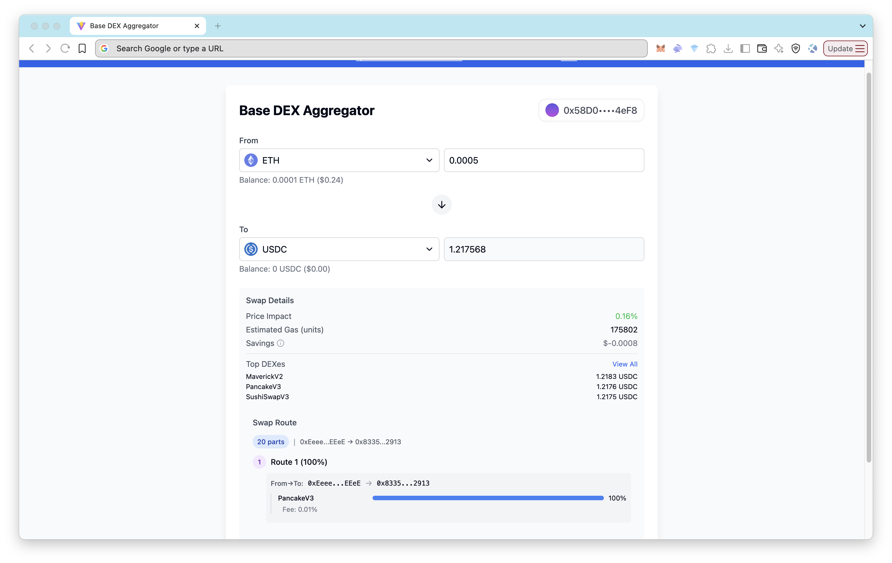

# Base DEX Aggregator App

A modern, user-friendly web application for performing token swaps on the Base blockchain. This application leverages QuickNode’s Base DeFi Bundle APIs to provide real-time gas estimation, optimized swap routing, and wallet tracking.



## Features

- **Token Swapping**: Swap tokens on Base blockchain using OpenOcean v4 Swap API
- **Real-time Gas Estimation**: View gas prices at different confidence levels (70%, 90%, 99%)
- **Wallet Integration**: Connect with popular wallets via RainbowKit (MetaMask, Rabby, WalletConnect, etc.)
- **Wallet History**: View your wallet balance, token holdings, and recent transactions

## Tech Stack

- **Frontend**: React with TypeScript
- **Web3 Libraries**: Viem, Wagmi
- **Wallet Adapter**: RainbowKit
- **Styling**: Tailwind CSS
- **API Client**: Axios
- **Build Tool**: Vite

## Prerequisites

Before you begin, ensure you have the following:

- Node.js 20.x or later
- npm, yarn, or pnpm
- A QuickNode endpoint URL with Base DeFi Bundle access
- A WalletConnect Project ID (for wallet connections)

## Installation

1. Clone the repository:

```bash
git clone https://github.com/quiknode-labs/qn-guide-examples.git
cd qn-guide-examples/sample-dapps/base-dex-aggregator
```

2. Install dependencies:


```bash
npm install
# or
yarn install
# or
pnpm install
```

## Environment Variables

Create a `.env` file in the root directory with the following variables:

```bash
VITE_WALLETCONNECT_PROJECT_ID="YOUR_WALLETCONNECT_PROJECT_ID"
VITE_QUICKNODE_ENDPOINT_URL="YOUR_QUICKNODE_ENDPOINT_URL"
```

You can get a WalletConnect Project ID by signing up at [WalletConnect Cloud](https://cloud.walletconnect.com).

## Running Locally

To start the development server:

```bash
npm run dev
# or
yarn dev
# or
pnpm dev
```

The application will be available at [http://localhost:5173](http://localhost:5173).

## Building for Production

To create a production build:

```bash
npm run build
# or
yarn build
# or
pnpm build
```

To preview the production build locally:

```bash
npm run preview
# or
yarn preview
# or
pnpm preview
```

## Deploying to Vercel

This project can be easily deployed to Vercel:

1. Push your code to a GitHub repository
2. Sign up or log in to [Vercel](https://vercel.com)
3. Click "New Project" and import your GitHub repository
4. Configure the project:

1. Framework Preset: Vite
2. Build Command: `npm run build` or `yarn build`
3. Output Directory: `dist`


5. Add your environment variables in the Vercel project settings:

  -  `VITE_QUICKNODE_ENDPOINT_URL`: Your QuickNode Base Endpoint URL
  -  `VITE_WALLETCONNECT_PROJECT_ID`: Your WalletConnect Project ID

6. Click "Deploy"

Alternatively, you can use the Vercel CLI:

```bash
# Install Vercel CLI
npm install -g vercel

# Deploy
vercel
```

## API Integrations

This application integrates with the following QuickNode [Base DeFi Power Bundle](https://marketplace.quicknode.com/bundles/basebundle) APIs:

1. **Gas Estimation API** (`sentio_gasPrice`): Provides real-time gas estimates for Base.
2. **OpenOcean v4 Swap API**: Used for token lists, swap quotes, and swap transactions.
3. **Base Blockbook JSON-RPC** (`bb_getAddress`): Fetches wallet balance, token holdings, and transaction history.

## Application Logic and Base Bundle Integration

This application demonstrates how to build a full-featured DeFi application using QuickNode's Base Bundle add-ons. Here's how each component of the Base Bundle is utilized:

### Gas Estimation with Sentio Gas API

The application uses the `sentio_gasPrice` RPC method to fetch real-time gas estimates for the Base network:

1. The `useGasEstimate` hook in `src/hooks/useGasEstimate.tsx` provides gas price data
2. Gas prices are used in swap calculations to provide accurate cost estimates
3. The implementation uses the JSON-RPC interface via axios in `src/lib/api.ts`

```typescript
// Example: Fetching gas estimates
export async function fetchGasEstimates() {
  const response = await axios.post(
    QUICKNODE_ENDPOINT_URL,
    {
      id: 1,
      jsonrpc: "2.0",
      method: "sentio_gasPrice",
      params: { chainId: BASE_CHAIN_ID },
    }
  );
  return response.data.blockPrices[0].estimatedPrices;
}
```

### Token Swaps with OpenOcean v4 API

The application integrates OpenOcean's v4 API through QuickNode's Base Bundle:

1. Token list retrieval for displaying available tokens
2. Swap quote generation with price impact and routing information
3. Swap execution
4. All OpenOcean endpoints are accessed via the QuickNode endpoint URL

```typescript
// Example: OpenOcean API URL construction
const OPENOCEAN_API_URL = `${QUICKNODE_ENDPOINT_URL}addon/807/v4/base`;
```

### Wallet History with Base Blockbook

The wallet history feature uses the Blockbook JSON-RPC interface:

1. The `useWalletHistory` hook fetches transaction history and token balances
2. The `bb_getAddress` method provides comprehensive wallet information
3. The wallet panel displays transaction history with timestamps and status

```typescript
// Example: Fetching wallet history
export async function fetchWalletHistory(address: string) {
  const response = await axios.post(
    QUICKNODE_ENDPOINT_URL,
    {
      id: 1,
      jsonrpc: "2.0",
      method: "bb_getAddress",
      params: [address, { page: 1, size: 20, details: "txids" }],
    }
  );
  return response.data;
}
```

This architecture demonstrates how QuickNode's Base Bundle provides a complete toolkit for building secure, high-performance DeFi applications without managing complex infrastructure.


