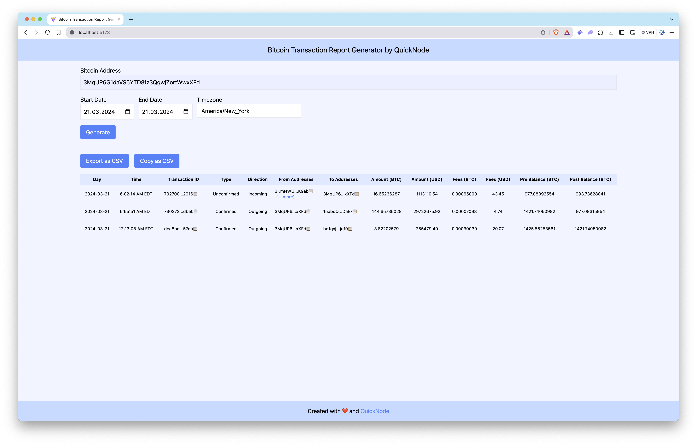

# Bitcoin Transaction Report Application

## Introduction

This application is designed to fetch and analyze Bitcoin transactions associated with a specific address, leveraging the capabilities of QuickNode's [Blockbook add-on](https://marketplace.quicknode.com/add-on/blockbook-rpc-add-on). It provides users with detailed reports within a specified date range, offering insights into transaction history, balances after each transaction, and the USD value of Bitcoin movements.

For an in-depth guide on how to fetch data and develop further functionalities, refer to [our comprehensive guide on QuickNode](https://www.quicknode.com/guides/quicknode-products/marketplace/how-to-generate-bitcoin-transaction-reports-with-blockbook) or [our script files](../../bitcoin/transaction-report-generator/).

### Tech Stack
- Frontend Framework/Library: React
- Language: TypeScript
- Build Tool/Development Server: Vite

## Features

- **Balance Calculation**: Calculates the BTC balance before and after each transaction.
- **Transaction Direction**: Identifies whether transactions are incoming or outgoing.
- **Confirmation Status**: Determines whether transactions are confirmed.
- **USD Conversion**: Computes the USD value of each transaction at the time it occurred.
- **Transaction Filtering**: Excludes internal wallet transactions that are not relevant to the address in question.
- **Date Range Filtering**: Generates reports for transactions within a specified date range.
- **Time Zone Selection**: Performs date filtering according to the selected timezone.
- **CSV Support**: Ability to export or copy result as CSV file.

## Getting Started

### Prerequisites

Before you begin, ensure you have the following:
- [Node.js](https://nodejs.org/en/) installed on your system.
- A QuickNode account with the [Blockbook RPC](https://marketplace.quicknode.com/add-on/blockbook-rpc-add-on) add-on enabled. 
    > Blockbook RPC is a paid add-on. Please check the details [here](https://marketplace.quicknode.com/add-on/blockbook-rpc-add-on) and compare plans based on your needs.
- A code editor or an IDE (e.g., [VS Code](https://code.visualstudio.com/))
- [Typescript](https://www.typescriptlang.org/) and [ts-node](https://typestrong.org/ts-node/)

> You can run the commands below to install TypeScript and ts-node globally to have TypeScript available across all projects.

```bash
npm install -g typescript
npm install -g ts-node
```

### Installation Dependencies

1. Clone the repository to your local machine:
```bash
git clone https://github.com/quiknode-labs/qn-guide-examples.git
```

2. Navigate to the project directory:
```bash
cd sample-dapps/bitcoin-transaction-report-generator
```

3. Install the necessary dependencies:
```bash
npm install
```

### Setting Environment Variables

Rename `.env.example` to `.env` and replace the `YOUR_QUICKNODE_BITCOIN_ENDPOINT_URL` placeholder with your QuickNode Bitcoin Node Endpoint. Make sure that the Blockbook RPC add-on is enabled.

```env
VITE_QUICKNODE_ENDPOINT = "YOUR_QUICKNODE_BITCOIN_ENDPOINT_URL"
```

> Please note that while we utilize `dotenv` for environment variable management, sensitive information like endpoints can still be visible on the frontend. This configuration is not recommended for production environments as-is.

### Running the Application

Run the development server:

```bash
npm run dev
```

Open [http://localhost:5173/](http://localhost:5173/) with your browser to see the application.

## Using the App

1. Input a Bitcoin wallet address.
2. (Optional) Select date range and time zone.
3. Press `Generate`. 
4. (Optional) Export or copy results as CSV.

The **Bitcoin Transaction Report Generator** application will query the Bitcoin blockchain for the wallet's transactions, filter these transactions data and calculate additional variables. Lastly, the app display results.

## Preview 



## Conclusion

[QuickNode's Blockbook add-on](https://marketplace.quicknode.com/add-on/blockbook-rpc-add-on) facilitates the creation of detailed Bitcoin transaction reports for developers and businesses alike. While this application covers the fundamentals, there's a vast scope for customization and extended functionalities. Whether for audit purposes, regulatory compliance, or market analysis, the Blockbook add-on streamlines the process of extracting blockchain data.

To discover more about how QuickNode assists auditing firms and individuals in extracting this type of data from blockchains, please [contact us](https://www.quicknode.com/contact-us); we're eager to engage with you!


