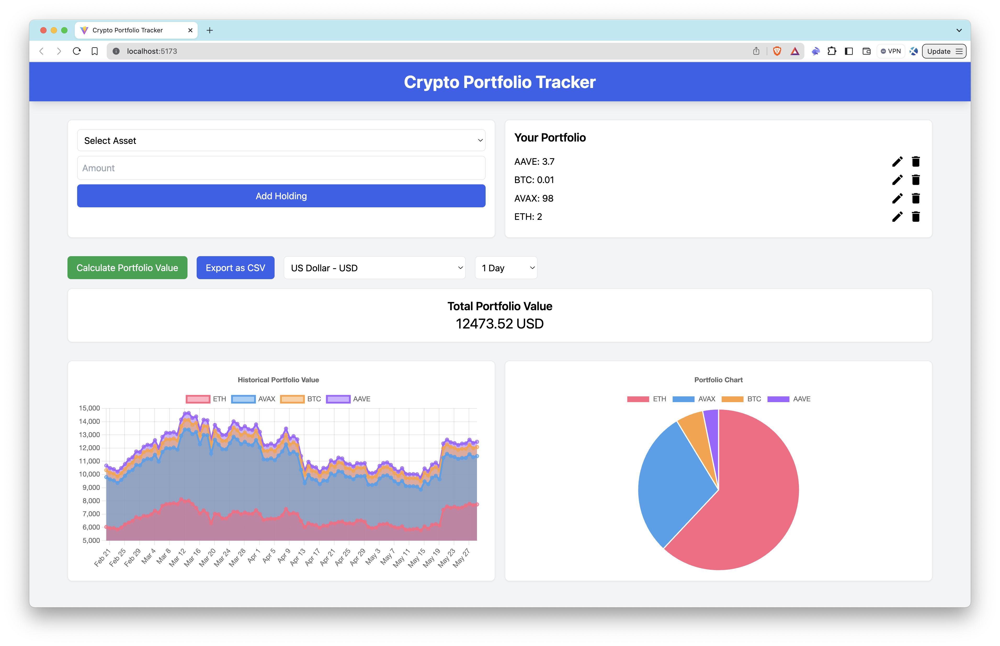

# Crypto Portfolio Tracker

## Overview

The Crypto Portfolio Tracker is a web application that allows users to input their cryptocurrency holdings and track their portfolio value over time. The app fetches current and historical exchange rates to display the total portfolio value and a chart of historical portfolio values in various currencies. It is built using TypeScript, Vite, and Tailwind CSS.

> For a detailed guide on how to build this application and utilize the [Crypto Market Data API](https://marketplace.quicknode.com/add-on/crypto-market-data-api), please visit our [comprehensive guide on QuickNode](https://www.quicknode.com/guides/quicknode-products/marketplace/how-to-build-a-crypto-portfolio-tracker-with-the-crypto-market-data-api).



## Features

- **Add and Manage Holdings**: Users can add, edit, and remove cryptocurrency holdings.
- **Current Portfolio Value**: Fetches and displays the current value of the portfolio in the selected currency.
- **Currency Selection**: Users can select the currency in which to view the portfolio value (default is USD).
- **Time Interval Selection**: Users can select the time interval for viewing the historical portfolio value.
- **Historical Portfolio Value**: Displays a chart of the portfolio's value over time.
- **Pie Chart**: Visual representation of the portfolio distribution in percentage and USD value.
- **Export Data**: Users can export the historical portfolio value data as a CSV file.

## Getting Started

### Prerequisites

Before you begin, ensure you have the following:
- [Node.js](https://nodejs.org/en/) installed on your system.
- A QuickNode account with the [Crypto Market Data API](https://marketplace.quicknode.com/add-on/crypto-market-data-api) enabled.
> Crypto Market Data API is a paid add-on. Please check the details [here](https://marketplace.quicknode.com/add-on/crypto-market-data-api) based on your needs.
- [Typescript](https://www.typescriptlang.org/) and [ts-node](https://typestrong.org/ts-node/)

You can install TypeScript and ts-node globally using the commands below:

```bash
npm install -g typescript ts-node
```

### Installation Dependencies

1. Clone the repository to your local machine:
```bash
git clone https://github.com/quiknode-labs/qn-guide-examples.git
```

2. Navigate to the project directory:
```bash
cd sample-dapps/crypto-portfolio-tracker
```

3. Install the necessary dependencies:
```bash
npm install
```

### Setting Environment Variables

Rename `.env.example` to `.env` and replace the `YOUR_QUICKNODE_ENDPOINT` placeholder with your QuickNode endpoint that the **Crypto Market Data API** is enabled.

```sh
VITE_QUICKNODE_ENDPOINT="YOUR_QUICKNODE_ENDPOINT"
```

> Please note that while we utilize `dotenv` for environment variable management, sensitive information like endpoints can still be visible on the frontend. This configuration is not recommended for production environments as-is.


### Running the Application

Run the development server:

```bash
npm run dev
```

Open [http://localhost:5173/](http://localhost:5173/) with your browser to see the application.

## Usage

- **Add Holdings**: Input the cryptocurrency asset and amount, then click **Add**.
- **Manage Holdings**: Edit or remove holdings as needed.
- **Select Currency**: Choose the currency in which to view your portfolio value.
- **Select Time Interval**: Choose the time interval for viewing historical portfolio value (e.g., 5 Minutes, 1 Hour, 1 Day).
- **View Current Portfolio Value**: The current portfolio value and pie chart are fetched immediately after you add or update assets to your holding.
- **View Historical Portfolio Value**: Click **Calculate Portfolio Value** to fetch the historical values.
- **Export Data**: Click **Export as CSV** to download your historical portfolio value data.

## Project Structure

- `src/`: Contains the source code for the application.
  - `components/`: Contains React components.
  - `interfaces/`: TypeScript interfaces for type definitions.
  - `services/`: Functions for fetching data from APIs.
  - `utils/`: Utility functions.
- `public/`: Static assets.
- `.env`: Environment variables.
- `vite.config.ts`: Vite configuration.

## API Integration

The application integrates with the following APIs:
- **QuickNode Crypto Market Data API**: For fetching current and historical exchange rates.
  - `v1/getAssets`: Fetch all available assets.
  - `v1/getCurrentExchangeRates`: Fetch current exchange rates.
  - `v1/getHistoricalExchangeRates`: Fetch historical exchange rates.

## Contributing

Contributions are welcome! Please open an issue or submit a pull request for any changes.

## Acknowledgements

- [QuickNode](https://www.quicknode.com/) for providing the Crypto Market Data API.
- [CoinAPI](https://www.coinapi.io/) for the market data.

## Contact

For any inquiries or issues, please contact [suysal@quicknode.com](mailto:suysal@quicknode.com).

## Conclusion

The **Crypto Portfolio Tracker** effectively utilizes **Crypto Market Data API** to provide a functional tool for managing and analyzing cryptocurrency portfolios. This application demonstrates how to integrate real-time and historical market data to track portfolio performance and gain valuable insights.

The features implemented here are just a starting point. You can customize and extend the application to suit your specific needs, whether for personal use, financial analysis, or development of crypto-related projects.