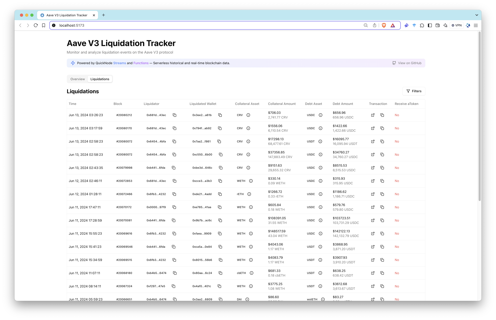

# Aave V3 Liquidation Tracker

Monitor and analyze liquidation events on the Aave V3 protocol in real-time. This project demonstrates the power of serverless blockchain data streaming using QuickNode's [Streams](https://www.quicknode.com/streams?utm_source=internal&utm_campaign=sample-apps&utm_content=aave-v3-liquidation-tracker).

| Dashboard Overview | Liquidations Table |
| --- | --- |
|  |  |

## Features

- 📊 Real-time liquidation monitoring
- 💰 Detailed metrics and analytics
- 📈 Historical liquidation trends
- 🔄 Asset distribution analysis
- ⚡ Serverless architecture

## Aave Pool Contract and LiquidationCall Event

### Aave V3 Pool Contract Overview
The **[Pool.sol](https://github.com/aave-dao/aave-v3-origin/blob/main/src/contracts/protocol/pool/Pool.sol)** contract (For Ethereum Mainnet, `0x87870Bca3F3fD6335C3F4ce8392D69350B4fA4E2`) in the Aave V3 protocol is the core of the lending and borrowing system. It facilitates deposits, borrowing, repayments, and liquidations.

### Event to Track: LiquidationCall
The **LiquidationCall** event is emitted when a liquidation occurs in the Aave protocol. It provides critical information about the liquidation transaction, including the collateral seized and the debt repaid.

```solidity

// Event Signature 
// 0xe413a321e8681d831f4dbccbca790d2952b56f977908e45be37335533e005286

LiquidationCall(
    address collateralAsset,
    address debtAsset,
    address user,
    uint256 debtToCover,
    uint256 liquidatedCollateralAmount,
    address liquidator,
    bool receiveAToken
)
```

#### Event Parameters
| **Parameter**            | **Type**   | **Description**                                             |
|--------------------------|------------|-------------------------------------------------------------|
| `collateralAsset`        | `address`  | The address of the asset being seized as collateral.         |
| `debtAsset`              | `address`  | The address of the asset that the liquidator is repaying.    |
| `user`                   | `address`  | The address of the borrower being liquidated.               |
| `debtToCover`            | `uint256`  | The amount of debt being repaid during the liquidation.      |
| `liquidatedCollateralAmount` | `uint256`  | The amount of collateral seized by the liquidator.          |
| `liquidator`             | `address`  | The address of the liquidator performing the liquidation.    |
| `receiveAToken`          | `bool`     | If `true`, liquidator receives aTokens instead of collateral.|

We will be using decoded logs of the `LiquidationCall` event to track liquidations on the Ethereum Mainnet.

## How It Works

This application uses a completely serverless architecture to track and analyze Aave V3 liquidation events:
1. **Data Collection**: **Streams** monitors the raw blockchain event data for Aave V3's liquidation events in both historical and real-time
2. **EVM Decoding**: **Streams** decode the raw event data using the [EVM Decoder](https://www.quicknode.com/docs/streams/filters#decoding-evm-data) to extract the relevant information
3. **Data Processing**: Using `viem` and webhooks, we temporarily listen to incoming data and process the decoded event data by fetching token prices and token details
4. **Data Storage**: Enriched event data is automatically stored in the PostgreSQL database
5. **Frontend Display**: React application fetches and displays the data with real-time updates

## Tech Stack

- **Frontend**
  - React
  - TypeScript
  - TanStack Query for data fetching
  - Tailwind CSS for styling
  - shadcn/ui for UI components
  - Recharts for data visualization

- **Backend (Serverless)**
  - QuickNode [Streams](https://www.quicknode.com/streams?utm_source=internal&utm_campaign=sample-apps) for historical and real-time blockchain data
  - [Supabase](https://supabase.com/) (PostgreSQL) for data storage

## Architecture

[Architecture Diagram](./images/architecture-chart.png)

The architecture demonstrates how the system leverages QuickNode's infrastructure to process blockchain data efficiently:

1. QuickNode Stream monitors Aave V3 contract events
2. Events are sent to webhook server for processing
3. Data is enriched with token and price information
4. Processed data is stored in Supabase
5. Frontend fetches and displays real-time data

## QuickNode Integration

### Streams

QuickNode Streams provide real-time blockchain data without running a node:

- Monitors Aave V3 contracts for liquidation events
- Filters and delivers only relevant events
- Pay only for the filtered data
- Ensures reliable data delivery with retry mechanisms
- Zero infrastructure maintenance required

### Webhooks

We are using a webhook server to: 

- Transforms blockchain data into application-ready format
- Enriches events with additional data
  - Fetching token metadata from blockchain (name, symbol, decimals) and storing them in Key-Value Store for future use
  - Real-time token prices from price feeds
  - Calculated USD values for all amounts
  - Historical price data for analytics
- Handles data validation and normalization
- Automatically stores processed data in the database

## Getting Started

### Prerequisites

- Node.js 18+
- npm or yarn
- Free trial [QuickNode](https://www.quicknode.com/signup?utm_source=internal&utm_campaign=sample-apps&utm_content=aave-v3-liquidation-tracker) account
- Free [Supabase](https://supabase.com/) account

### Installation

1. Clone the repository:

```bash
git clone https://github.com/quiknode-labs/qn-guide-examples.git
cd qn-guide-examples/sample-dapps/ethereum-aave-liquidation-tracker
```

2. Install dependencies:

```bash
npm install
```

3. Create a new project and database in [Supabase](https://supabase.com). Save the database password for later use.

4. Create a `.env` file and add your [Supabase](https://supabase.com) URL and publishable key. You can get the URL and key from the Supabase dashboard by clicking the **Connect** button in the project.

```env
VITE_SUPABASE_URL=your_supabase_url
VITE_SUPABASE_ANON_KEY=your_supabase_anon_key
```

5. Set up your database using the provided schema:

```sql
CREATE TABLE liquidations (
    id SERIAL PRIMARY KEY,
    liquidator_address character varying(42) NOT NULL,
    liquidated_wallet character varying(42) NOT NULL,
    collateral_asset character varying(42) NOT NULL,
    collateral_asset_name character varying(100),
    collateral_asset_symbol character varying(20),
    collateral_asset_price numeric(20,6),
    collateral_seized_amount numeric(78,18),
    debt_asset character varying(42) NOT NULL,
    debt_asset_name character varying(100),
    debt_asset_symbol character varying(20),
    debt_asset_price numeric(20,6),
    debt_repaid_amount numeric(78,18),
    transaction_hash character varying(66) NOT NULL,
    block_number bigint NOT NULL,
    receive_a_token boolean NOT NULL,
    timestamp timestamp without time zone NOT NULL
);
```

6. Start the development server:

```bash
npm run dev
```

### Setting up Webhook Server

1. Start your webhook server by running `ngrok http YOUR_PORT_NUMBER`. For this project, the default value is set to 3005 but feel free to change this in `.env`. 
2. Once the server is established, you will use your generated ngrok link (e.g., `https://abcd.ngrok-free.app`) and append `/webhook` endpoint which is where we listen to incoming data from Quicknode streams. 

### Setting up QuickNode Streams

1. Create a QuickNode account at [quicknode.com](https://quicknode.com)
2. Set up a new Stream:
   - Select the chain and network (e.g., Ethereum Mainnet)
   - Select the dataset as `Blocks with Receipts`
   - Select start and end block numbers (for real-time data, keep `Stream end` as `Doesn't end`)
   - Select the Modify the payload section and add the following **Streams Filtering Code**
   - Select a test block (e.g., `18983377`) and click `Run test`
   - Select the destination as `Webhook` and add your webhook URL with `/webhook` endpoint added. 
   - Optionally, you can add your Stream's security token in `.env` to utilize [advanced security features](https://www.quicknode.com/guides/quicknode-products/streams/validating-incoming-streams-webhook-messages). 

> The contract addresses, test blocks, and other configurations may vary depending on the specific project and network you are working with. In this app, we use Ethereum Mainnet and the Aave V3 protocol.

You can get the full code for the Streams Filtering Function below or view it [here](./qn-related/stream.js).

<details>  
<summary>View Streams Filtering Code</summary>

```js
// Filtering function on Streams
function main(stream) {
  try {
    // Aave V3 LiquidationCall ABI
    const aaveLiquidationAbi = `[{
      "anonymous": false,
      "inputs": [
        {"indexed": true, "type": "address", "name": "collateralAsset"},
        {"indexed": true, "type": "address", "name": "debtAsset"},
        {"indexed": true, "type": "address", "name": "user"},
        {"indexed": false, "type": "uint256", "name": "debtToCover"},
        {"indexed": false, "type": "uint256", "name": "liquidatedCollateralAmount"},
        {"indexed": false, "type": "address", "name": "liquidator"},
        {"indexed": false, "type": "bool", "name": "receiveAToken"}
      ],
      "name": "LiquidationCall",
      "type": "event"
    }]`;

    // Pool.sol addresses for Aave V3 (lowercase)
    const normalizedAddresses = ["0x87870bca3f3fd6335c3f4ce8392d69350b4fa4e2"];

    // Handle both payload and stream parameter styles
    const data = stream?.data ? stream.data : stream;

    // Early validation - return null to skip (per QuickNode docs)
    if (!data?.[0]?.block?.timestamp || !data?.[0]?.receipts?.length) {
      return null;
    }

    const timestamp = parseInt(data[0].block.timestamp, 16);

    // Decode receipts
    const decodedReceipts = decodeEVMReceipts(data[0].receipts, [aaveLiquidationAbi]);

    // Validate decoded receipts
    if (!decodedReceipts || !Array.isArray(decodedReceipts) || decodedReceipts.length === 0) {
      return null;
    }

    // Filter for liquidation events
    const filteredLogs = decodedReceipts
      .filter(r => r?.decodedLogs?.length > 0)
      .flatMap(r => r.decodedLogs)
      .filter(log =>
        log?.name === "LiquidationCall" &&
        log?.address &&
        normalizedAddresses.includes(log.address.toLowerCase())
      );

    // Return data if found, null otherwise (per QuickNode docs)
    return filteredLogs?.length > 0
      ? { timestamp, filteredLogs }
      : null;
  } catch (e) {
    // Return null to skip on error (per QuickNode docs)
    return null;
  }
}
```

</details>

<br />

#### QuickNode Setup
1. Log in to your [QuickNode dashboard](https://dashboard.quicknode.com).
2. Create a new Endpoint for your chain and network (e.g., Ethereum Mainnet).
3. Copy the RPC URL and paste it into the `QUICKNODE_RPC_URL` variable in the `.env` file. 

#### Database Setup
1. Log in to your **Supabase dashboard**.
2. Navigate to your project and click the **Connect** button.
3. Under **Connection info**, click **App Frameworks** and set Framework to React and Using **Vite** framework. 
4. Copy `VITE_SUPABASE_URL` and `VITE_SUPABASE_PUBLISHABLE_DEFAULT_KEY` to `.env`. 

### Setting up PostgreSQL Functions

To fetch the data from the database, you can use the following PostgreSQL queries to create some functions. These functions are used in the frontend to display the data.

<details> 
<summary>View PostgreSQL Functions Code</summary>

```sql
-- get_asset_distributions
CREATE OR REPLACE FUNCTION get_asset_distributions()
RETURNS json AS $$
DECLARE
  interval_start timestamp;
BEGIN
  interval_start := CASE time_range
    WHEN '24h' THEN NOW() - INTERVAL '24 hours'
    WHEN '7d' THEN NOW() - INTERVAL '7 days'
    WHEN '30d' THEN NOW() - INTERVAL '30 days'
    WHEN '365d' THEN NOW() - INTERVAL '365 days'
    ELSE NOW() - INTERVAL '30 days'
  END;

  RETURN json_build_object(
    'topCollateralAssets', (
      SELECT json_agg(row_to_json(t))
      FROM (
        SELECT 
          collateral_asset_symbol as symbol,
          COUNT(*) as count,
          SUM(collateral_seized_amount * collateral_asset_price) as totalValueUSD,
          SUM((collateral_seized_amount * collateral_asset_price) - (debt_repaid_amount * debt_asset_price)) as totalProfitUSD,
          (COUNT(*)::float / (SELECT COUNT(*) FROM liquidations WHERE timestamp >= interval_start)::float * 100) as percentageOfTotal
        FROM liquidations
        WHERE timestamp >= interval_start
        GROUP BY collateral_asset_symbol
        ORDER BY count DESC
        LIMIT 5
      ) t
    ),
    'topDebtAssets', (
      SELECT json_agg(row_to_json(t))
      FROM (
        SELECT 
          debt_asset_symbol as symbol,
          COUNT(*) as count,
          SUM(debt_repaid_amount * debt_asset_price) as totalValueUSD,
          SUM((collateral_seized_amount * collateral_asset_price) - (debt_repaid_amount * debt_asset_price)) as totalProfitUSD,
          (COUNT(*)::float / (SELECT COUNT(*) FROM liquidations WHERE timestamp >= interval_start)::float * 100) as percentageOfTotal
        FROM liquidations
        WHERE timestamp >= interval_start
        GROUP BY debt_asset_symbol
        ORDER BY count DESC
        LIMIT 5
      ) t
    )
  );
END;
$$ LANGUAGE plpgsql;
```

```sql
-- get_metrics_overview
CREATE OR REPLACE FUNCTION get_metrics_overview()
RETURNS json AS $$
BEGIN
  RETURN json_build_object(
    'total24h', (
      SELECT json_build_object(
        'count', COUNT(*),
        'valueUSD', COALESCE(SUM(debt_repaid_amount * debt_asset_price), 0),
        'profitUSD', COALESCE(SUM((collateral_seized_amount * collateral_asset_price) - (debt_repaid_amount * debt_asset_price)), 0)
      )
      FROM liquidations
      WHERE timestamp >= NOW() - INTERVAL '24 hours'
    ),
    'total7d', (
      SELECT json_build_object(
        'count', COUNT(*),
        'valueUSD', COALESCE(SUM(debt_repaid_amount * debt_asset_price), 0),
        'profitUSD', COALESCE(SUM((collateral_seized_amount * collateral_asset_price) - (debt_repaid_amount * debt_asset_price)), 0)
      )
      FROM liquidations
      WHERE timestamp >= NOW() - INTERVAL '7 days'
    ),
    'total30d', (
      SELECT json_build_object(
        'count', COUNT(*),
        'valueUSD', COALESCE(SUM(debt_repaid_amount * debt_asset_price), 0),
        'profitUSD', COALESCE(SUM((collateral_seized_amount * collateral_asset_price) - (debt_repaid_amount * debt_asset_price)), 0)
      )
      FROM liquidations
      WHERE timestamp >= NOW() - INTERVAL '30 days'
    ),
    'total365d', (
      SELECT json_build_object(
        'count', COUNT(*),
        'valueUSD', COALESCE(SUM(debt_repaid_amount * debt_asset_price), 0),
        'profitUSD', COALESCE(SUM((collateral_seized_amount * collateral_asset_price) - (debt_repaid_amount * debt_asset_price)), 0)
      )
      FROM liquidations
      WHERE timestamp >= NOW() - INTERVAL '365 days'
    ),
    'topLiquidators', (
      SELECT json_agg(row_to_json(t))
      FROM (
        SELECT 
          liquidator_address as address,
          COUNT(*) as count,
          SUM(debt_repaid_amount * debt_asset_price) as totalValueUSD,
          AVG(debt_repaid_amount * debt_asset_price) as avgLiquidationUSD,
          SUM((collateral_seized_amount * collateral_asset_price) - (debt_repaid_amount * debt_asset_price)) as totalProfitUSD,
          AVG((collateral_seized_amount * collateral_asset_price) - (debt_repaid_amount * debt_asset_price)) as avgProfitUSD
        FROM liquidations
        GROUP BY liquidator_address
        ORDER BY totalProfitUSD DESC
        LIMIT 5
      ) t
    ),
    'topLiquidatedUsers', (
      SELECT json_agg(row_to_json(t))
      FROM (
        SELECT 
          liquidated_wallet as address,
          COUNT(*) as count,
          SUM(debt_repaid_amount * debt_asset_price) as totalValueUSD,
          AVG(debt_repaid_amount * debt_asset_price) as avgLiquidationUSD,
          SUM((collateral_seized_amount * collateral_asset_price) - (debt_repaid_amount * debt_asset_price)) as totalLossUSD,
          AVG((collateral_seized_amount * collateral_asset_price) - (debt_repaid_amount * debt_asset_price)) as avgLossUSD
        FROM liquidations
        GROUP BY liquidated_wallet
        ORDER BY count DESC
        LIMIT 5
      ) t
    ),
    'largestLiquidations', (
      SELECT json_agg(row_to_json(t))
      FROM (
        SELECT 
          transaction_hash as txHash,
          timestamp,
          debt_repaid_amount * debt_asset_price as valueUSD,
          (collateral_seized_amount * collateral_asset_price) - (debt_repaid_amount * debt_asset_price) as profitUSD,
          collateral_asset_symbol as collateralAsset,
          debt_asset_symbol as debtAsset,
          liquidator_address as liquidator,
          liquidated_wallet as liquidatedUser
        FROM liquidations
        ORDER BY debt_repaid_amount * debt_asset_price DESC
        LIMIT 5
      ) t
    ),
    'mostProfitableLiquidations', (
      SELECT json_agg(row_to_json(t))
      FROM (
        SELECT 
          transaction_hash as txHash,
          timestamp,
          debt_repaid_amount * debt_asset_price as valueUSD,
          (collateral_seized_amount * collateral_asset_price) - (debt_repaid_amount * debt_asset_price) as profitUSD,
          collateral_asset_symbol as collateralAsset,
          debt_asset_symbol as debtAsset,
          liquidator_address as liquidator,
          liquidated_wallet as liquidatedUser
        FROM liquidations
        ORDER BY ((collateral_seized_amount * collateral_asset_price) - (debt_repaid_amount * debt_asset_price)) DESC
        LIMIT 5
      ) t
    )
  );
END;
$$ LANGUAGE plpgsql;
```

```sql
-- get_liquidation_trends
CREATE OR REPLACE FUNCTION get_liquidation_trends()
RETURNS json AS $$
DECLARE
  interval_start timestamp;
  grouping_interval text;
BEGIN
  SELECT 
    CASE time_range
      WHEN '24h' THEN NOW() - INTERVAL '24 hours'
      WHEN '7d' THEN NOW() - INTERVAL '7 days'
      WHEN '30d' THEN NOW() - INTERVAL '30 days'
      WHEN '365d' THEN NOW() - INTERVAL '365 days'
      ELSE NOW() - INTERVAL '30 days'
    END,
    CASE time_range
      WHEN '24h' THEN 'hour'
      WHEN '7d' THEN 'day'
      WHEN '30d' THEN 'day'
      WHEN '365d' THEN 'month'
      ELSE 'day'
    END
  INTO interval_start, grouping_interval;

  RETURN (
    SELECT json_agg(row_to_json(t))
    FROM (
      SELECT 
        date_trunc(grouping_interval, timestamp) as date,
        COUNT(*) as count,
        COALESCE(SUM(debt_repaid_amount * debt_asset_price), 0) as totalValueUSD,
        COALESCE(SUM((collateral_seized_amount * collateral_asset_price) - (debt_repaid_amount * debt_asset_price)), 0) as totalProfitUSD
      FROM liquidations
      WHERE timestamp >= interval_start
      GROUP BY date_trunc(grouping_interval, timestamp)
      ORDER BY date_trunc(grouping_interval, timestamp)
    ) t
  );
END;
$$ LANGUAGE plpgsql;
```

</details> 

### Setting up PostgreSQL Indexes

For better query performance, we can create indexes on the `liquidations` table. Here's an example of how to create the necessary indexes:

```sql
CREATE UNIQUE INDEX liquidations_pkey ON liquidations(id int4_ops);
CREATE INDEX idx_debt_asset ON liquidations(debt_asset_symbol text_ops);
CREATE INDEX idx_timestamp ON liquidations(timestamp timestamp_ops);
CREATE INDEX idx_liquidator_address ON liquidations(liquidator_address text_ops);
CREATE INDEX idx_liquidated_wallet ON liquidations(liquidated_wallet text_ops);
CREATE INDEX idx_collateral_asset ON liquidations(collateral_asset_symbol text_ops);
CREATE INDEX idx_liquidations_assets ON liquidations(collateral_asset_symbol text_ops,debt_asset_symbol text_ops);
```

## Development

### Project Structure

```
src/
  ├── components/       # Reusable UI components
  ├── hooks/            # Custom React hooks
  ├── lib/              
  │   ├── security.ts          # Validating incoming Streams data 
  │   ├── server.ts            # Our webhook server 
  │   ├── supabase-backend.ts  # Supabase keys for backend operations
  │   ├── supabase-frontend.ts # Supabase keys for frontend operations
  │   ├── transform.ts         # Data transformation of incoming Streams data 
  │   └── utils.ts             # General utility functions
  └── types/            # TypeScript type definitions
```

### Available Scripts

- `npm run dev`: Start development server
- `npm run build`: Build for production
- `npm run lint`: Run ESLint

## Contributing

1. Fork the repository
2. Create your feature branch (`git checkout -b feature/amazing-feature`)
3. Commit your changes (`git commit -m 'Add amazing feature'`)
4. Push to the branch (`git push origin feature/amazing-feature`)
5. Open a Pull Request

## Possible Future Features

### Advanced Features

- Real-time notifications for:

  - Large liquidations
  - Specific assets
  - Price threshold alerts

- Whale wallet tracking
- Custom alert thresholds
- Portfolio risk assessment
- Integration with other DeFi protocols

### Technical Enhancements

- WebSocket support for real-time updates
- Multiple network support (Polygon, Arbitrum, etc.)
- Advanced data visualization options
- Mobile app version
- API access for developers
