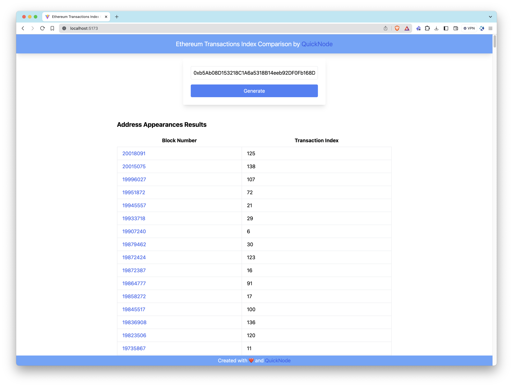
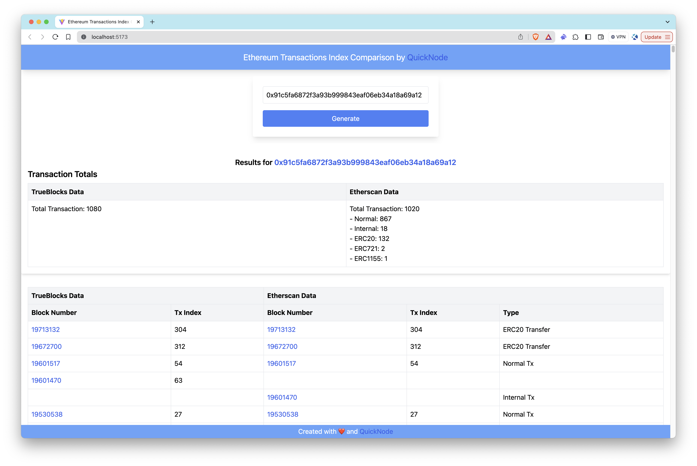

# Ethereum Address Appearances Application

## Introduction

This application is designed to fetch and analyze Ethereum transactions associated with a specific address, leveraging the capabilities of QuickNode's [Address Appearances API](https://marketplace.quicknode.com/add-on/address-appearances-api). The primary focus of this application is to provide users with transaction appearances using the **Address Appearances API**. However, if you would like to compare these results with Etherscan's API, you can provide an Etherscan API key to enable the comparison feature.

For an in-depth guide on how to fetch data and develop further functionalities, refer to [our comprehensive guide on QuickNode](https://www.quicknode.com/guides/quicknode-products/marketplace/improve-your-ethereum-audits-with-address-appearances-api).

### Tech Stack
- Frontend Framework/Library: React
- Language: TypeScript
- Build Tool/Development Server: Vite
- Styling: Tailwind CSS

## Features

- **Transaction Appearances**: Provides detailed transaction appearances using QuickNode's Address Appearances API.
- **Optional Transaction Comparison**: Enables comparison with Etherscan API if an Etherscan API key is provided.

## Getting Started

### Prerequisites

Before you begin, ensure you have the following:
- [Node.js](https://nodejs.org/en/) installed on your system.
- A QuickNode account with the [Address Appearances API](https://marketplace.quicknode.com/add-on/address-appearances-api) enabled.
- A code editor or an IDE (e.g., [VS Code](https://code.visualstudio.com/))
- [TypeScript](https://www.typescriptlang.org/) and [ts-node](https://typestrong.org/ts-node/)

> You can run the commands below to install TypeScript and ts-node globally to have TypeScript available across all projects.

```bash
npm install -g typescript ts-node
```

### Installation Dependencies

1. Clone the repository to your local machine:
```bash
git clone https://github.com/quiknode-labs/qn-guide-examples.git
```

2. Navigate to the project directory:
```bash
cd sample-dapps/ethereum-address-appearances
```

3. Install the necessary dependencies:
```bash
npm install
```

### Setting Environment Variables

Rename `.env.example` to `.env` and replace the `YOUR_QUICKNODE_ETHEREUM_ENDPOINT_URL` placeholder with your QuickNode Ethereum Node Endpoint. Make sure that the [Address Appearances API](https://marketplace.quicknode.com/add-on/address-appearances-api) is enabled.

```env
VITE_QUICKNODE_ENDPOINT = "YOUR_QUICKNODE_ETHEREUM_ENDPOINT_URL"
```

If you provide an Etherscan API key in the .env file like the one below, the app displays appearance results from both sources for a specified address.

```env
VITE_QUICKNODE_ENDPOINT="YOUR_QUICKNODE_ETHEREUM_ENDPOINT_URL"
VITE_ETHERSCAN_API_KEY="YOUR_ETHERSCAN_API_KEY"
```

> Please note that while we utilize `dotenv` for environment variable management, sensitive information like endpoints can still be visible on the frontend. This configuration is not recommended for production environments as-is.

### Running the Application

Run the development server:

```bash
npm run dev
```

Open [http://localhost:5173/](http://localhost:5173/) with your browser to see the application.

## Using the App
1. Input an Ethereum address.
2. Press Generate.
3. View the transaction appearances.

The **Ethereum Address Appearances Application** will query the Ethereum blockchain for the address's transactions, fetch the data using QuickNode's Address Appearances API, and display the results.



If an Etherscan API key is provided, the app will display the comparison of transactions found by QuickNode's Address Appearances API and Etherscan API.



## Conclusion

QuickNode's [Address Appearances API](https://marketplace.quicknode.com/add-on/address-appearances-api) excels in identifying more transaction appearances compared to other sources. This enhanced capability provides developers and businesses with more comprehensive and accurate transaction data. By leveraging this API, users can gain deeper insights into blockchain interactions. 

Whether for audit purposes, regulatory compliance, or market analysis, QuickNode's Address Appearances API ensures you have the most detailed and accurate transaction data available. To discover more about how QuickNode assists companies and individuals in extracting comprehensive blockchain data, please [contact us](https://www.quicknode.com/contact-us); we're eager to engage with you!