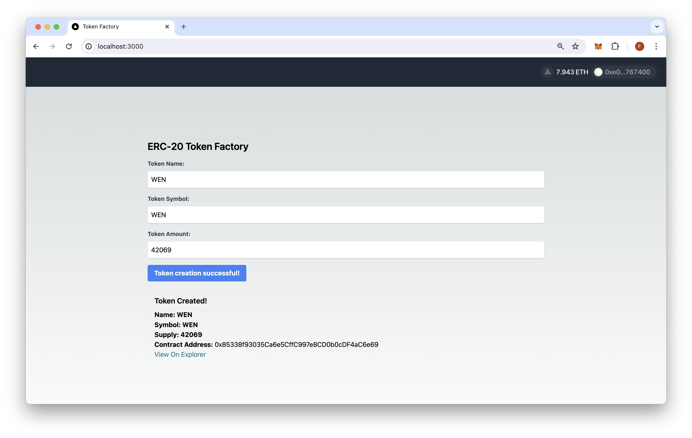
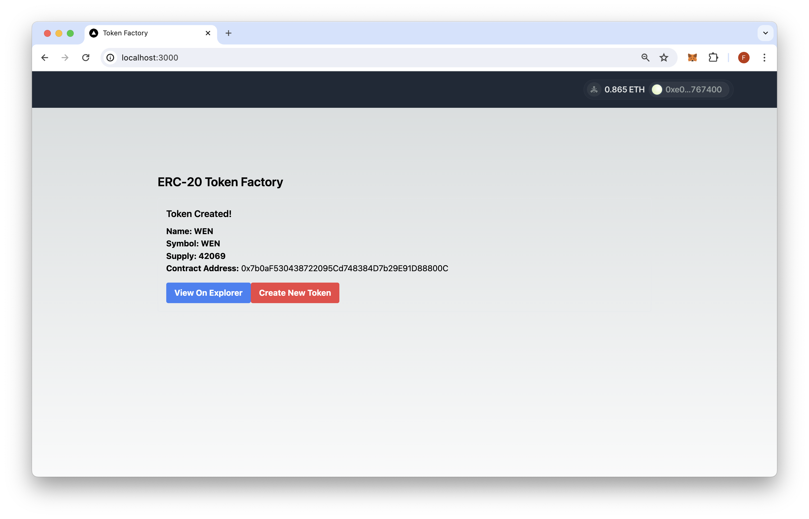

# QuickNode EVM Token Factory Demo

## Overview

This simple demo lets you create an ERC-20 token on any EVM-compatible blockchain. The demo will allow you to set an ERC-20 token's `name`, `symbol`, and `initialSupply`. Current supported networks include Sepolia and Holesky (feel free to add more!)





The demo uses [Next.js 14](https://nextjs.org/) project bootstrapped with [`create-next-app`](https://github.com/vercel/next.js/tree/canary/packages/create-next-app).

## Getting Started

Open the project directory:

```bash
cd sample-dapps/evm-token-factory
```

### Set Environment Variables

1. Rename `.env.example` to `.env.local `and update it with RPC URLs for each blockchain. Also, include your [WalletConnect](https://cloud.walletconnect.com/). project ID (optionally, you can leave this blank but some features will not be supported). To create RPC URLs for each chain, you can run your own node locally or use a service like [QuickNode](https://quicknode.com) to quickly spin up a node endpoint.

### Configure Smart Contract Addresses

2. Update the `factoryAddress` value in `evm-token-factory/app/utils/ethereum.ts` with your deployed factory contract address. This is the address you received in the output during the [Deployment](https://quicknode.com/guides/ethereum-development/dapps/how-to-create-an-evm-token-factory-dapp#deployment) section.

3. Remove any unused chains (e.g., mainnet) from the `src/context/web3modal.tsx` file.

### RPC Configuration

This app requires a valid RPC URL for each blockchain you want to support. Here are more details on how RPC is configured throughout the app.

- The RPC URLs referenced in the `.env.local` file are for the WalletConnect modal.
- To send transactions, the app utilizes the `ethers.BrowserProvider` class to wrap an injected provider (e.g., MetaMask, Rabby, Coinbase Wallet) and use the providers RPC configuration. Therefore, users interacting with the app should have the network they're creating tokens on added to their wallet and switched to that RPC network. Failing to do so will result in the app displaying a "This app doesn’t support your current network. Switch to an available option following to continue." message.

If you do not want to support a blockchain(s), you can remove references of the chain(s) from the `src/context/web3modal.tsx` file.

### Install Dependencies

Then, install the dependencies:

```bash
npm install
# or
yarn
# or
pnpm install
# or
bun install
```

After, start the development server:

```bash
npm run dev
# or
yarn dev
# or
pnpm dev
# or
bun dev
```

Open [http://localhost:3000](http://localhost:3000) with your browser to see the app.

## Using the Dapp

1. Connect your wallet
    - Make sure you have enough ETH (or other native EVM gas token) in your wallet to cover the create token transaction
    - If you are using Testnet, you can get free ETH from the [QuickNode Faucet](https://faucet.quicknode.com/)
2. Click "Create Token" and confirm the transaction to create the ERC-20 token!

### Architecture


```sh
├── app
│   ├── api
│   │   └── evm
│   │       └── createToken
│   │           └── route.ts # API Method for calling CreateToken function
│   ├── components
│   │   ├── Connect.tsx # Web3Modal Component
│   │   ├── Footer.tsx
│   │   └── Navbar.tsx
│   ├── favicon.ico
│   ├── globals.css
│   ├── layout.tsx # The Web3Modal component
│   ├── page.tsx # Main page for Token Factory
│   └── utils
│       ├── abi.json # Factory ABI
│       └── ethereum.ts # Chain configuration and helpers
├── context
│   └── web3modal.tsx # Wallet Adapter Context providers 
├── contracts
│   ├── README.md
│   ├── foundry.toml # Forge configuration
│   ├── lib # Dependencies
│   ├── remappings.txt # Library mappings
│   ├── script
│   │   ├── Counter.s.sol
│   │   └── CreateToken.s.sol
│   ├── src
│   │   ├── Counter.sol
│   │   ├── Factory.sol
│   │   └── Token.sol
│   └── test
│       ├── Counter.t.sol
│       ├── Factory.t.sol
│       └── Token.t.sol
├── next-env.d.ts
├── next.config.mjs
├── package-lock.json
├── package.json
├── postcss.config.mjs
├── public
│   ├── next.svg
│   ├── preview.png
│   ├── preview2.png
│   └── vercel.svg
├── .env.example # Configure RPCs and WalletConnect Project ID
├── tailwind.config.ts
└── tsconfig.json
```

## Smart Contracts

The ERC-20 Token Factory backend built on smart contracts with Solidity can be deployed on any EVM-compatible blockchain. For demonstration purposes, we have deployed the Token Factory to the Sepolia and Holesky testnet. It has not been deployed to any mainnet or L2 chains yet due to gas fee constraints but feel free to deploy it and open a PR in this repo.

The ERC-20 Token Factory is built with two smart contracts:

- **Factory**: The Factory contract (`contracts/Factory.sol`) inherits the Token.sol smart contract and acts as a Factory for creating and tracking new ERC-20 tokens.

- **Token**: This is an ERC-20 smart contract (`contracts/Token.sol`) defined by the OpenZeppelin standard and includes a `mint` and `transferOwnership` function call in the constructor upon deployment.

### Supported Chains & Addresses

- **Sepolia**: 0x28D99a0A1B430B3669B8A2799dCDd7d332ceDb1C
- **Holesky**: 0x5fCCa8dCeD28B13f2924CB78B934Ab0AF445542A

### Deploy the Factory to another EVM blockchain

To deploy the Factory contract on a new chain using Foundry, follow these steps:

1. Ensure [Foundry](https://book.getfoundry.sh/) is installed and navigate inside the `contracts` directory. Install the required dependencies with the following commands:

```sh
forge install foundry-rs/forge-std --no-commit
forge install OpenZeppelin/openzeppelin-contracts --no-commit
```

2. Build (compile) the smart contracts using the `forge build` command.

3. Run tests using the `forge test` command.

4. To deploy, run the `forge create` command below and input the proper RPC network and private key values:

```sh
forge create --rpc-url QUICKNODE_HTTP_URL \
--private-key YOUR_PRIVATE_KEY \
src/Factory.sol:TokenFactory
```

5. Edit the `src/context/web3modal.tsx` file and add a new chain object with its chain ID (find a list [here](https://chainlist.org/)), name, native gas token currency, explorer URL, and RPC URL (e.g., QuickNode):

```javascript
export const mainnet = {
  chainId: 1,
  name: 'Ethereum',
  currency: 'ETH',
  explorerUrl: 'https://etherscan.io',
  rpcUrl: process.env.NEXT_PUBLIC_MAINNET_RPC_URL
}
```

6. Add the Factory address and explorer URL to the `CHAINS` object in `app/utils/ethereum.ts`. For example:

```javascript
    1: { // Ethereum Mainnet
        factoryAddress: "FACTORY_ADDRESS",
        explorerUrl: "https://etherscan.io", 
    },
```

If you would like to learn more about creating and deploying smart contracts, check out these resources:

- [How to Create and Deploy a Smart Contract with Hardhat](https://www.quicknode.com/guides/ethereum-development/smart-contracts/how-to-create-and-deploy-a-smart-contract-with-hardhat)
- [https://www.quicknode.com/guides/ethereum-development/smart-contracts/intro-to-foundry](https://www.quicknode.com/guides/ethereum-development/smart-contracts/intro-to-foundry)
- [Different Ways to Verify Your Smart Contract Code](https://www.quicknode.com/guides/ethereum-development/smart-contracts/different-ways-to-verify-smart-contract-code)
- [How to Create and Deploy an ERC20 Token](https://www.quicknode.com/guides/ethereum-development/smart-contracts/how-to-create-and-deploy-an-erc20-token)

## Next.js Documentation

To learn more about Next.js, take a look at the following resources:

- [Next.js Documentation](https://nextjs.org/docs) - learn about Next.js features and API.
- [Learn Next.js](https://nextjs.org/learn) - an interactive Next.js tutorial.

You can check out [the Next.js GitHub repository](https://github.com/vercel/next.js/) - your feedback and contributions are welcome!