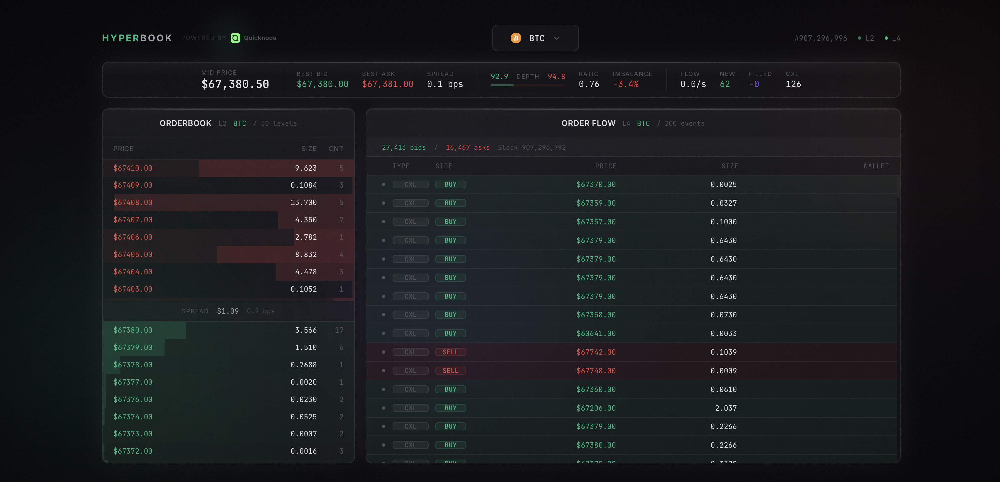

# Hyperbook

Real-time Hyperliquid orderbook visualizer built with the [Quicknode Hyperliquid SDK](https://github.com/quiknode-labs/hyperliquid-sdk/tree/main/typescript) and [Quicknode gRPC streams](https://www.quicknode.com/docs/hyperliquid/grpc-api).



## How it works

Hyperbook connects to two Quicknode gRPC endpoints to stream live orderbook data from Hyperliquid's HyperCore using the `@quicknode/hyperliquid-sdk`:

- **StreamL2Book** (aggregated depth) - total size at each price level. Runs in a worker thread via the SDK's `GRPCStream.l2Book()`.
- **StreamL4Book** (individual orders) - every order placement, cancel, and fill with wallet addresses. Runs in a separate worker thread via the SDK's `GRPCStream.l4Book()`.

Both streams run in Node.js worker threads to keep the main thread free for SSE delivery.

## Links

- [Quicknode Hyperliquid SDK](https://github.com/quiknode-labs/hyperliquid-sdk/tree/main/typescript) ([npm](https://www.npmjs.com/package/@quicknode/hyperliquid-sdk))
- [Hyperliquid API overview](https://www.quicknode.com/docs/hyperliquid)
- [gRPC API setup](https://www.quicknode.com/docs/hyperliquid/grpc-api)
- [`StreamL2Book` dataset](https://www.quicknode.com/docs/hyperliquid/datasets/l2-book)
- [`StreamL4Book` dataset](https://www.quicknode.com/docs/hyperliquid/datasets/l4-book)

## Setup

1. Create two Hyperliquid endpoints on [Quicknode](https://www.quicknode.com/chains/hyperliquid) (one per stream, limited to 1 concurrent gRPC stream per endpoint)

2. Copy `.env.local.example` to `.env.local` and fill in your endpoint URLs:

```
QUICKNODE_ENDPOINT_L2=https://your-endpoint.hype-mainnet.quiknode.pro/your-token
QUICKNODE_ENDPOINT_L4=https://your-endpoint.hype-mainnet.quiknode.pro/your-token
```

3. Install and run:

```bash
npm install
npm run dev
```

Open [http://localhost:3000](http://localhost:3000).