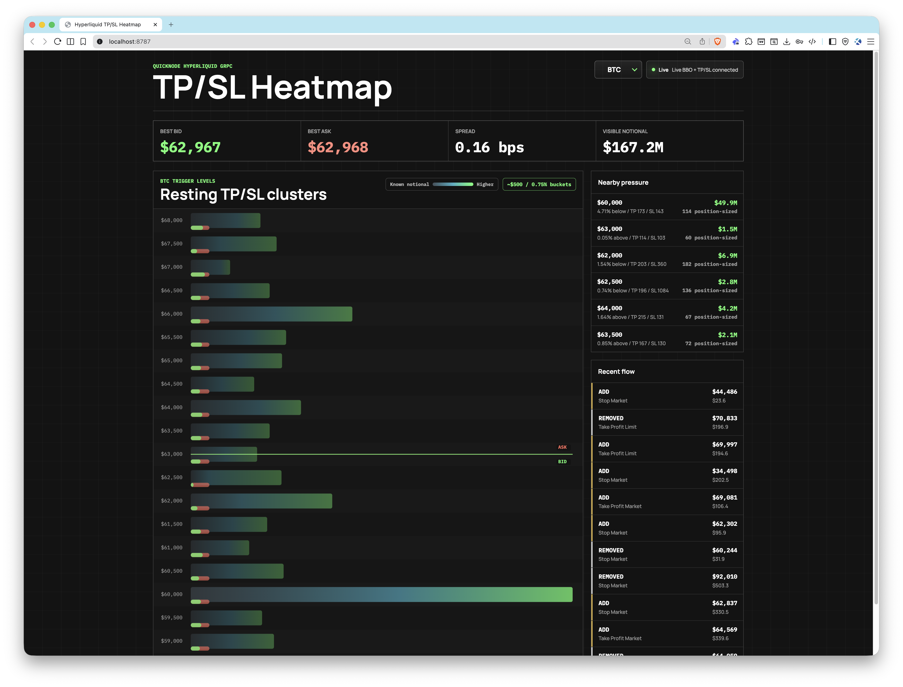

# hyperliquid-tpsl-heatmap

A live browser dashboard for visualizing resting Hyperliquid TP/SL trigger orders as price-level clusters, anchored against current bid/ask from Quicknode gRPC streams.

The app uses `StreamTpslUpdates` for trigger-order ADD/REMOVE lifecycle data and `StreamBboBook` for the live price anchor. Position-sized TP/SL orders with `sz: "0.0"` are counted but excluded from notional intensity because the stream does not expose their final size.



## Prerequisites

- Node.js 18+
- pnpm
- Quicknode Hyperliquid gRPC endpoint with dataset access

## Run

```bash
pnpm install
cp .env.example .env
pnpm dev
```

Open `http://localhost:8787`.

Set these values in `.env` for live mode:

```bash
QUICKNODE_GRPC_ENDPOINT=your-endpoint.hype-mainnet.quiknode.pro:10000
QUICKNODE_GRPC_TOKEN=your-auth-token
DEMO_MODE=false
```

If credentials are missing, the app starts in clearly labeled demo mode. You can also force demo mode with `DEMO_MODE=true`.

Do not commit `.env`. It contains your Quicknode endpoint token.

## Configure

```bash
TARGET_COINS=BTC,ETH,SOL
DEFAULT_COIN=BTC
BUCKET_SIZE_PCT=0.75
PORT=8787
```

`TARGET_COINS` should use Hyperliquid perp symbols for TP/SL data, such as `BTC`, `ETH`, `SOL`, or `HYPE`.
`BUCKET_SIZE_PCT` scales bucket width by current mid price, then rounds to a readable increment. For example, `0.75` is roughly `$500` buckets on BTC near `$64k`, `$25` buckets on ETH near `$3.4k`, and `$1` buckets on SOL near `$140`.

The server subscribes to every coin in `TARGET_COINS` for both `StreamTpslUpdates` and `StreamBboBook`. Those streams consume data for all configured coins, even when the browser is currently viewing only one asset. Keep `TARGET_COINS` to the assets you actually want to monitor.

## How It Works

- `src/server/streams.ts` opens `StreamTpslUpdates` and `StreamBboBook` concurrently.
- `src/server/cluster-store.ts` maintains open trigger orders by `oid`, groups them into rounded price buckets, and tracks current BBO.
- `src/server/server.ts` pushes the current state to the browser over WebSocket.
- `src/client/HeatmapCanvas.tsx` renders the bucket heatmap and bid/ask overlays.

The heatmap intensity represents known notional in each bucket. TP and SL orders are combined into one price-level heatmap because traders usually care about total trigger pressure near the current market, but each bucket still shows TP and SL counts separately. The small marker on each row shows the TP/SL mix: green for take-profit share and red for stop-loss share. Position-sized TP/SL orders are counted in TP/SL totals and recent flow, but excluded from notional intensity because the stream reports `sz: "0.0"` until trigger time.

Guide 4 maps to the TP/SL ADD/REMOVE logic and cluster aggregation. Guide 1 maps to the BBO stream that anchors the current bid, ask, and spread.

## Useful Docs

- StreamTpslUpdates: https://www.quicknode.com/docs/hyperliquid/grpc-api/StreamTpslUpdates
- StreamBboBook: https://www.quicknode.com/docs/hyperliquid/grpc-api/StreamBboBook
- TP/SL dataset: https://www.quicknode.com/docs/hyperliquid/datasets/tpsl-updates
- BBO dataset: https://www.quicknode.com/docs/hyperliquid/datasets/bbo-book
