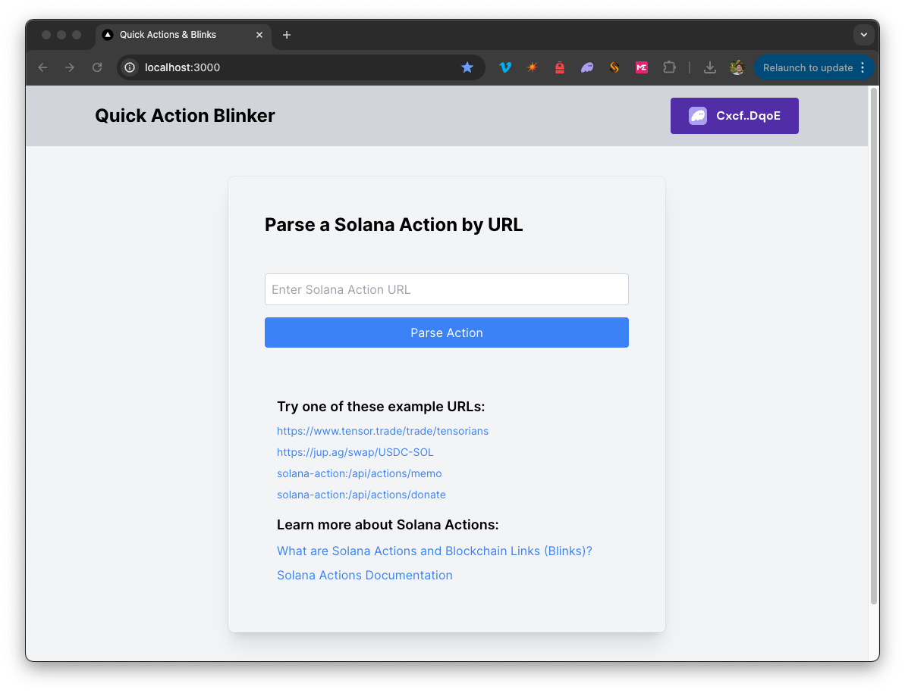
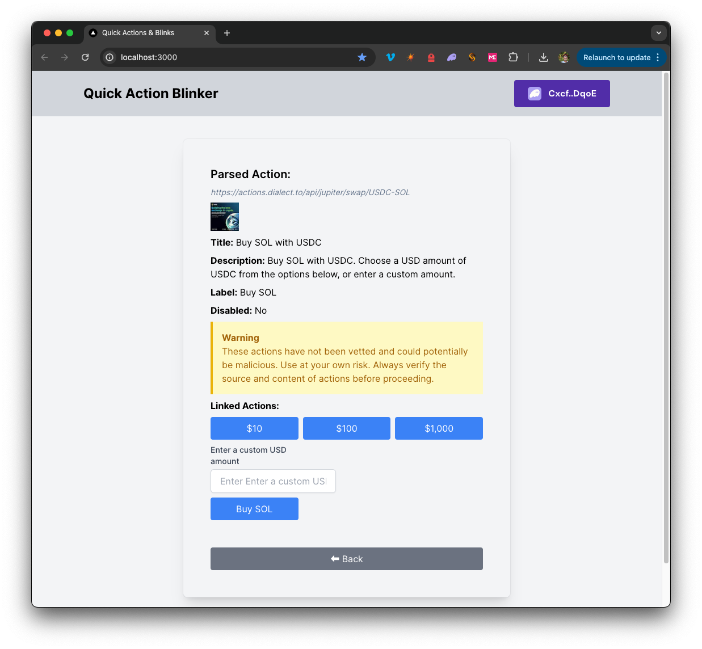

# QuickNode Solana Action Blinker

## Overview

This is a simple demo let's you create Solana Actions and will parse Solana action URLs to their respective actions.



The demo uses [Next.js 14](https://nextjs.org/) project bootstrapped with [`create-next-app`](https://github.com/vercel/next.js/tree/canary/packages/create-next-app).

### Background

Solana Actions provide a standardized way to deliver signable transactions or messages from an application directly to a user. 
Blinks are client apps that convert Solana Actions into shareable, metadata-rich UIs for interacting with and executing Actions.
For more information, check out our [Guide on Solana Actions](https://www.quicknode.com/guides/solana-development/solana-pay/actions-and-blinks/).

## Getting Started

### Install Dependencies

Open the project dictory: 

```bash
cd sample-dapps/solana-action-blinker
```
Then, install the dependencies:

```bash
npm install
# or
yarn
# or
pnpm install
# or
bun install
```

### Set Environment Variables

Make sure you have a QuickNode endpoint handy--you can get one free [here](https://www.quicknode.com/signup?utm_source=internal&utm_campaign=dapp-examples&utm_content=solana-action-blinker).

- Rename `.env.example` to `.env.local` and update with your QuickNode Solana Node Endpoint.
- Make sure to update the cluster to ensure your transaction URLs point to the correct explorer (use only of the enum values provided in the `.env.example` file).

```env
QN_ENDPOINT=https://example.solana-mainnet.quiknode.pro/123456
NEXT_PUBLIC_CLUSTER=mainnet-beta # mainnet-beta | devnet | testnet | local
```

First, run the development server:

```bash
npm run dev
# or
yarn dev
# or
pnpm dev
# or
bun dev
```

Open [http://localhost:3000](http://localhost:3000) with your browser to see the result.

## Using the Dapp

1. Enter a [valid Solana Action URL](https://solana.com/docs/advanced/actions#detecting-actions-via-blinks) in the input field. You may copy and paste one of the example links on the homepage.
2. Click "Parse Action" to see the parsed action details.
3. You will see the parsed details of the action URL. To see and execute available actions, connect a wallet. 



4. Click any of the available actions to execute the action (you will need to sign the transaction when prompted by your wallet).
5. You may create additional actions by following the structure in `solana-action-blinker/app/api/actions`

### Architecture

```bash
src/
├── app/
│   ├── page.tsx # Main page for Blink
│   └── layout.tsx # layout for the page
│   └── api/
│       └── solana/
│           └── sendAndConfirm/route.ts # Send and Confirm Transaction
│       └── actions/
│           └── memo/route.ts  # Creates a Memo Solana Action
│           └── donate/route.ts  # Creates a Donate Solana Action
└── components/
│   ├── ActionComponents/     # includes components for parsing and executing Solana Actions
│   ├── Blink.tsx        # Main component
│   ├── SolanaProviders.tsx     # Wallet Adapter Context providers
│   └── [supporting components]
└── hooks/
│   ├── useActionFetch.ts  # Fetches and parses Solana Actions from URLs
│   └── useTransactionProcessor.ts  # Executes Solana Transactions
└── utils/ # includes various utility functions and constants

```

## Deploy on Vercel

[](https://vercel.com/new/clone?repository-url=https%3A%2F%2Fgithub.com%2Fquiknode-labs%2Fqn-guide-examples%2Fsample-dapps%2Fsolana-action-blinker&env=QN_ENDPOINT,NEXT_PUBLIC_CLUSTER&envDescription=Requires%20a%20Solana%20Endpoint&envLink=https%3A%2F%2Fdashboard.quicknode.com%2Fendpoints&project-name=solana-action-blinker&repository-name=solana-action-blinker&redirect-url=https%3A%2F%2Fdashboard.quicknode.com%2F&demo-title=Quick%20Actions%20Blinker&demo-description=A%20sample%20tool%20for%20creating%20%26%20parsing%20Solana%20Actions%20and%20Generating%20Blinks%20)

## Next.js Documentation

To learn more about Next.js, take a look at the following resources:

- [Next.js Documentation](https://nextjs.org/docs) - learn about Next.js features and API.
- [Learn Next.js](https://nextjs.org/learn) - an interactive Next.js tutorial.

You can check out [the Next.js GitHub repository](https://github.com/vercel/next.js/) - your feedback and contributions are welcome!
