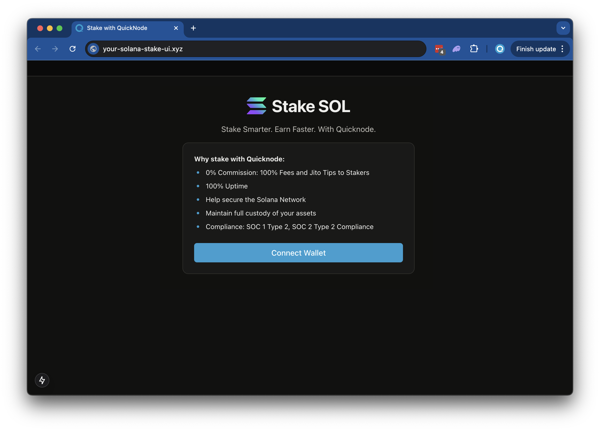

# QuickNode Solana Staking UI

## Overview
This is a simple demo let's stand up a staking page to easily empower your users to stake to your validator. The demo will:



The demo uses 
- [Solana Kit](https://github.com/anza-xyz/kit)
- [Wallet Standard](https://www.npmjs.com/package/@wallet-standard/core)
- [Next.js 15](https://nextjs.org/) project bootstrapped with [`create-next-app`](https://github.com/vercel/next.js/tree/canary/packages/create-next-app).
- [Radix UI](https://www.radix-ui.com/)


## Getting Started

### Install Dependencies

Open the project dictory: 

```bash
cd sample-dapps/solana-staking-ui
```
Then, install the dependencies:

```bash
npm install
# or
yarn
# or
pnpm install
# or
bun install
```

### Set Environment Variables

Make sure you have a QuickNode endpoint handy--you can get one free [here](https://www.quicknode.com/signup?utm_source=internal&utm_campaign=dapp-examples&utm_content=solana-staking-ui).

- Rename `.env.example` to `.env` and update with your QuickNode Solana Node Endpoint.
- Specify which cluster you are using (mainnet-beta, devnet) (using `NEXT_PUBLIC_NETWORK_ENV`).
- Specify the validator vote address that your staker should stake to (using `NEXT_PUBLIC_VALIDATOR_ADDRESS`). The default value, `5s3vajJvaAbabQvxFdiMfg14y23b2jvK6K2Mw4PYcYK` is QuickNode's validator.

```sh
DEVNET_RPC_ENDPOINT=https://example.solana-devnet.quiknode.pro/12345/
MAINNET_RPC_ENDPOINT=https://example.solana-mainnet.quiknode.pro/12345/
NEXT_PUBLIC_NETWORK_ENV=mainnet
NEXT_PUBLIC_VALIDATOR_ADDRESS=5s3vajJvaAbabQvxFdiMfg14y23b2jvK6K2Mw4PYcYK
```

First, run the development server:

```bash
npm run dev
# or
yarn dev
# or
pnpm dev
# or
bun dev
```

Open [http://localhost:3000](http://localhost:3000) with your browser to see the result.

## Using the Dapp

1. Upload an Image (this will be used for your token metadata)
2. Fill out the form with the token details
3. Connect your wallet
    - Make sure you have ~0.04 SOL in your wallet to cover the new account fees
    - If you are using Devnet, you can get free SOL from the [Solana Faucet](https://faucet.quicknode.com/)
4. Click "Mint" to upload your image and metadata to IPFS and mint your token!

### Architecture

```bash
src/
├── app/
│   ├── page.tsx
│   └── layout.tsx
│   └── api/
│       └── balance/
│       │   └── route.ts   # Get wallet SOL balance   
│       └── stake/
│       │   └── fetch/route.ts  # Get a wallets' staking accounts
│       │   └── generate/route.ts   # Generate staking accounts 
│       └── transaction/
│           └── confirm/route.ts  # Confirm a transaction
└── components/
    ├── stake/     # Various staking components
    └── [supporting components]
└── context/       # Wallet connect context
└── hooks/         # Is wallet connected hook
└── utils/         # Is wallet connected hook
    ├── solana/    # Solana staking and account utils
    └── config.ts  # Network settup
    └── constants.ts 
```

## Deploy on Vercel

[](https://vercel.com/new/clone?repository-url=https%3A%2F%2Fgithub.com%2Fquiknode-labs%2Fqn-guide-examples%2Fsample-dapps%2Fsolana-staking-ui&env=DEVNET_RPC_ENDPOINT,MAINNET_RPC_ENDPOINT,NEXT_PUBLIC_NETWORK_ENV,NEXT_PUBLIC_VALIDATOR_ADDRESS&envDescription=QuickNode%20Endpoint%20and%20Validator%20Address&envLink=https%3A%2F%2Fdashboard.quicknode.com%2F%3Fprompt%3Dsignup&project-name=quicknode-stake-ui&repository-name=quicknode-stake-ui&demo-title=QuickNode%20Stake%20%20Solana%20UI&demo-description=A%20landing%20page%20for%20staking%20Solana)
