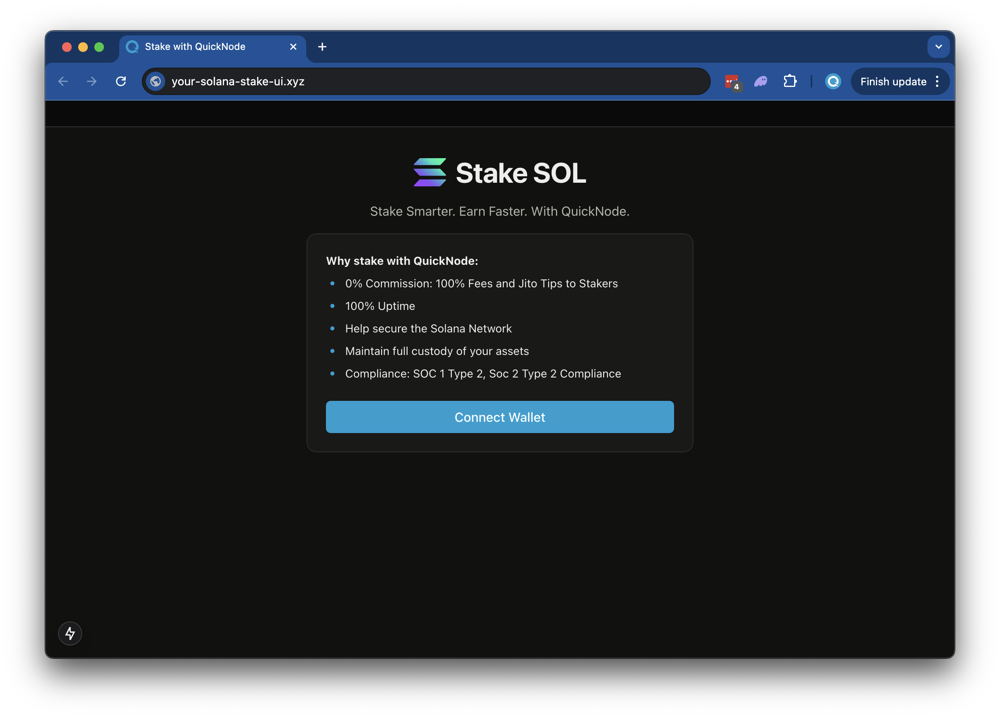

# Quicknode Solana Staking UI

## Overview

This is a simple demo let's stand up a staking page to easily empower your users to stake to your validator. The demo will:



The demo uses

- [Solana Kit](https://github.com/anza-xyz/kit)
- [Wallet Standard](https://www.npmjs.com/package/@wallet-standard/core)
- [Next.js 15](https://nextjs.org/) project bootstrapped with [`create-next-app`](https://github.com/vercel/next.js/tree/canary/packages/create-next-app).
- [Radix UI](https://www.radix-ui.com/)

## Getting Started

### Install Dependencies

Open the project directory:

```bash
cd sample-dapps/solana-staking-ui
```

Then, install the dependencies:

```bash
npm install
# or
yarn
# or
pnpm install
# or
bun install
```

### Set Environment Variables

Make sure you have a Quicknode endpoint handy--you can [get one free](https://www.quicknode.com/signup?utm_source=internal&utm_campaign=dapp-examples&utm_content=solana-staking-ui).

- Rename `.env.example` to `.env` and update with your Quicknode Solana Node Endpoint.
- Specify which cluster you are using (mainnet-beta, devnet) (using `NEXT_PUBLIC_NETWORK_ENV`).
- Specify the validator vote address that your staker should stake to (using `NEXT_PUBLIC_VALIDATOR_ADDRESS`). The default value, `5s3vajJvaAbabQvxFdiMfg14y23b2jvK6K2Mw4PYcYK` is Quicknode's validator.
- Add your [Jupiter API key](https://dev.jup.ag/portal/setup) (using `JUPITER_API_KEY`) for fetching SOL price data.

```sh
DEVNET_RPC_ENDPOINT=https://example.solana-devnet.quiknode.pro/12345/
MAINNET_RPC_ENDPOINT=https://example.solana-mainnet.quiknode.pro/12345/
NEXT_PUBLIC_NETWORK_ENV=mainnet
NEXT_PUBLIC_VALIDATOR_ADDRESS=5s3vajJvaAbabQvxFdiMfg14y23b2jvK6K2Mw4PYcYK
JUPITER_API_KEY=your_jupiter_api_key_here
```

First, run the development server:

```bash
npm run dev
# or
yarn dev
# or
pnpm dev
# or
bun dev
```

Open [http://localhost:3000](http://localhost:3000) with your browser to see the result.

## Using the Dapp

1. **Connect your wallet**
   - Click the `Connect Wallet` button
   - Make sure you have sufficient SOL in your wallet to cover:
     - The amount you want to stake
     - Transaction fees (~0.001 SOL)
     - Stake account creation rent (~0.0025 SOL)
 
2. **Enter stake amount**
   - Enter the amount of SOL you want to stake
   - The USD equivalent will be displayed automatically based on current SOL price

3. **Review validator information**
   - The app displays the validator (QuickNode by default) and its APY

4. **Stake your SOL**
   - Click the `Stake` button to send the staking transaction
   - Approve the transaction in your wallet
   - Wait for transaction confirmation (usually a few seconds)
   - A success modal will appear with your transaction signature and stake account address

5. **View your stake accounts**
   - After staking, your existing stake accounts will be displayed
   - You can expand/collapse the `Your Stake Accounts` section to view all your stakes

### Architecture

```bash
├── app/
│   ├── api/
│   │   ├── balance/
│   │   │   └── route.ts
│   │   ├── stake/
│   │   │   ├── fetch/
│   │   │   │   └── route.ts 
│   │   │   └── generate/
│   │   │       └── route.ts
│   │   └── transaction/
│   │       └── confirm/
│   │           └── route.ts
│   ├── globals.css
│   ├── layout.tsx
│   └── page.tsx
├── components/
│   ├── stake/
│   │   ├── FeaturesList.tsx
│   │   ├── StakeAccountsTable.tsx
│   │   ├── StakeButton.tsx
│   │   ├── StakeSuccessModal.tsx
│   │   ├── StakingForm.tsx
│   │   ├── ValidatorInfo.tsx
│   │   └── WalletHeader.tsx
│   ├── ErrorDialog.tsx
│   ├── Nav.tsx
│   ├── Title.tsx
│   ├── WalletConnectButton.tsx
│   └── WalletDisconnectButton.tsx
├── context/
│   ├── SelectedWalletAccountContext.tsx
│   └── SelectedWalletAccountContextProvider.tsx
├── hooks/
│   └── useIsWalletConnected.tsx
└── utils/
    ├── solana/
    │   ├── stake/
    │   │   ├── get-stake-accounts.ts
    │   │   ├── stake-filters.ts
    │   │   ├── stake-instructions.ts
    │   │   └── struct.ts
    │   ├── address.ts
    │   ├── balance.ts
    │   ├── price.ts
    │   ├── rpc.ts
    │   └── status.ts
    ├── config.ts
    ├── constants.ts
    └── errors.tsx
```

## Deploy on Vercel

[](https://vercel.com/new/clone?repository-url=https%3A%2F%2Fgithub.com%2Fquiknode-labs%2Fqn-guide-examples%2Fsample-dapps%2Fsolana-staking-ui&env=DEVNET_RPC_ENDPOINT,MAINNET_RPC_ENDPOINT,NEXT_PUBLIC_NETWORK_ENV,NEXT_PUBLIC_VALIDATOR_ADDRESS&envDescription=Quicknode%20Endpoint%20and%20Validator%20Address&envLink=https%3A%2F%2Fdashboard.quicknode.com%2F%3Fprompt%3Dsignup&project-name=quicknode-stake-ui&repository-name=quicknode-stake-ui&demo-title=Quicknode%20Stake%20%20Solana%20UI&demo-description=A%20landing%20page%20for%20staking%20Solana)
