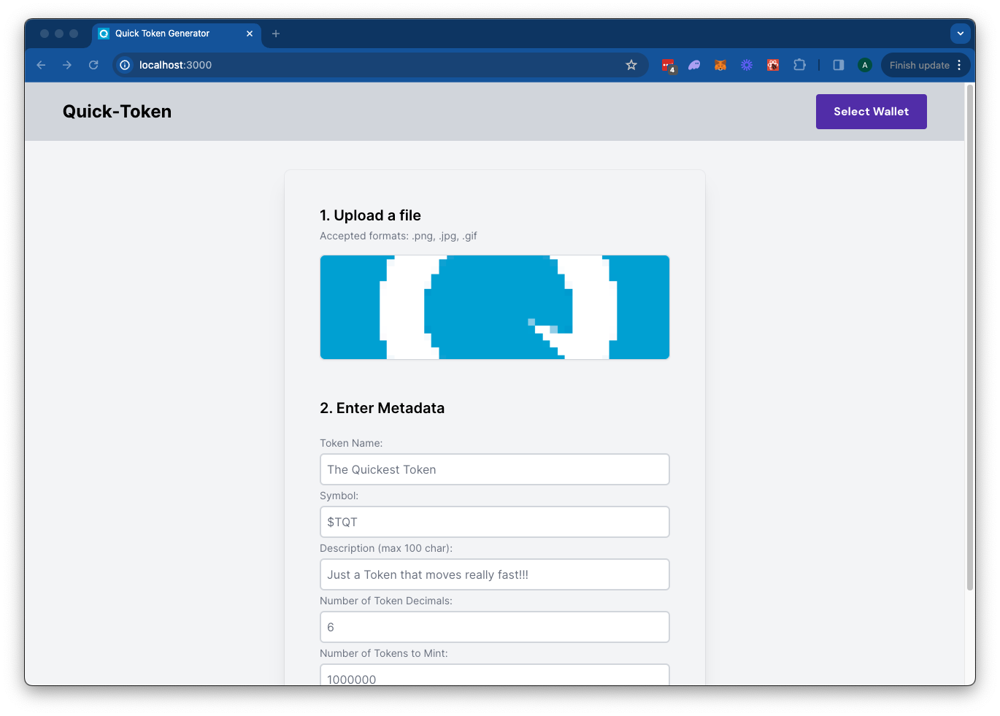

# QuickNode Solana Token-Minter Demo

## Overview
This is a simple demo let's you create a fungible token on the Solana blockchain. The demo will:
- Upload your image to IPFS using [QuickNode's IPFS API](https://www.quicknode.com/ipfs).



The demo uses [Next.js 14](https://nextjs.org/) project bootstrapped with [`create-next-app`](https://github.com/vercel/next.js/tree/canary/packages/create-next-app).


## Getting Started

### Install Dependencies

Open the project dictory: 

```bash
cd sample-dapps/solana-token-maker
```
Then, install the dependencies:

```bash
npm install
# or
yarn
# or
pnpm install
# or
bun install
```

### Set Environment Variables

Make sure you have a QuickNode endpoint handy--you can get one free [here](https://www.quicknode.com/signup?utm_source=internal&utm_campaign=dapp-examples&utm_content=token-maker).

- Rename `.env.example` to `.env.local` and update with your QuickNode Solana Node Endpoint and QuickNode IPFS key.
- Make sure to update the cluster to ensure your transaction URLs point to the correct explorer (use only of the enum values provided in the `.env.example` file).
- You can use QuickNode's public IPFS Gateway URL or replace it with your own.

```env
QN_IPFS_API=QN_abc123456789xyz_REPLACE_THIS
QN_ENDPOINT=https://example.solana-mainnet.quiknode.pro/123456
NEXT_PUBLIC_CLUSTER=mainnet-beta # mainnet-beta | devnet | testnet | local
NEXT_PUBLIC_GATEWAY_URL=https://quicknode.quicknode-ipfs.com/ipfs/
```

First, run the development server:

```bash
npm run dev
# or
yarn dev
# or
pnpm dev
# or
bun dev
```

Open [http://localhost:3000](http://localhost:3000) with your browser to see the result.

## Using the Dapp

1. Upload an Image (this will be used for your token metadata)
2. Fill out the form with the token details
3. Connect your wallet
    - Make sure you have ~0.04 SOL in your wallet to cover the new account fees
    - If you are using Devnet, you can get free SOL from the [Solana Faucet](https://faucet.quicknode.com/)
4. Click "Mint" to upload your image and metadata to IPFS and mint your token!

### Architecture

```bash
src/
├── app/
│   ├── page.tsx
│   └── layout.tsx
│   └── api/
│       └── solana/
│           └── createMintTx/route.ts   # Create New Mint Transaction   
│           └── sendAndConfirm/route.ts # Send and Confirm Transaction
│       └── upload/
│           └── image/route.ts  # IPFS Image Upload
│           └── json/route.ts   # IPFS JSON Upload
└── components/
    ├── SolanaProviders.tsx     # Wallet Adapter Context providers
    ├── Minter.tsx              # Main component
    └── [supporting components]
```

## Deploy on Vercel

[](https://vercel.com/new/clone?repository-url=https%3A%2F%2Fgithub.com%2Fquiknode-labs%2Fqn-guide-examples%2Ftree%2Fmain%2Fsample-dapps%2Fsolana-token-maker&env=QN_IPFS_API,QN_ENDPOINT,NEXT_PUBLIC_CLUSTER,NEXT_PUBLIC_GATEWAY_URL&envDescription=Requires%20QuickNode%20Endpoint%20and%20QN%20IPFS%20API%20Key&envLink=https%3A%2F%2Fdashboard.quicknode.com%2Fendpoints&project-name=quicknode-token-minter&repository-name=quicknode-token-minter&redirect-url=https%3A%2F%2Fdashboard.quicknode.com%2Fendpoints&demo-image=https%3A%2F%2Fgithub.com%2Fquiknode-labs%2Fqn-guide-examples%2Ftree%2Fmain%2Fsample-dapps%2Fsolana-token-maker%2Fpublic%2Fpreview.png)

## Next.js Documentation

To learn more about Next.js, take a look at the following resources:

- [Next.js Documentation](https://nextjs.org/docs) - learn about Next.js features and API.
- [Learn Next.js](https://nextjs.org/learn) - an interactive Next.js tutorial.

You can check out [the Next.js GitHub repository](https://github.com/vercel/next.js/) - your feedback and contributions are welcome!

