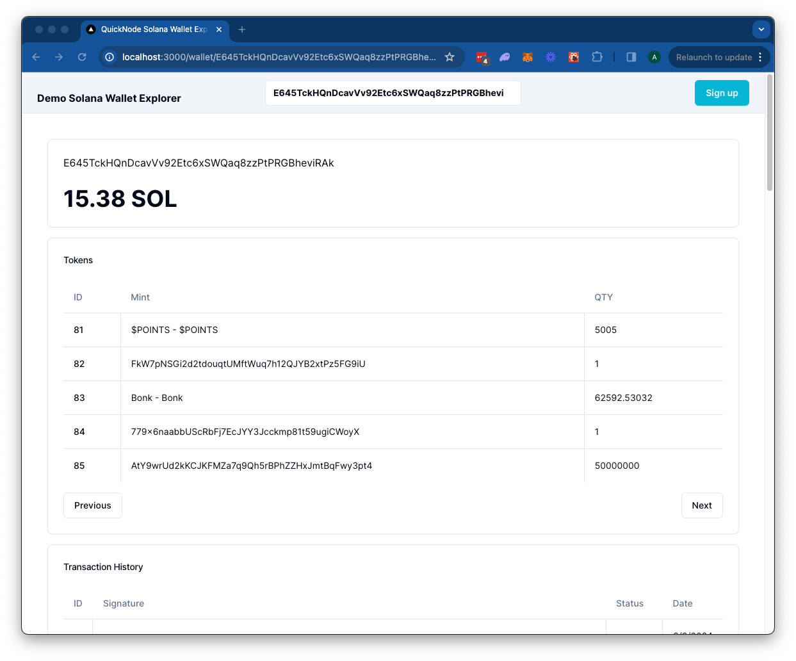

# QuickNode Solana Explorer Demo

## Overview
This is a simple demo of how to use your QuickNode Solana Node Endpoint to query the Solana blockchain for tokens, transactions, and NFTs for a given wallet.

The demo uses [Next.js 14](https://nextjs.org/) project bootstrapped with [`create-next-app`](https://github.com/vercel/next.js/tree/canary/packages/create-next-app).


## Getting Started

### Install Dependencies

First, install the dependencies:

```bash
npm install
# or
yarn
# or
pnpm install
# or
bun install
```

### Set Environment Variables

Make sure you have a QuickNode endpoint handy--you can get one free [here](https://www.quicknode.com/signup?utm_source=internal&utm_campaign=dapp-examples&utm_content=solana-explorer).

Rename `.env.example` to `.env.local` and update with your QuickNode Solana Node Endpoint. Enable the DAS API only if you have enabled the DAS add-on for your QuickNode Solana Node Endpoint.

```env
SOLANA_RPC_URL=https://example.solana-mainnet.quiknode.pro/123456/
DAS_API_ENABLED=true
NEXT_PUBLIC_FETCH_JUPLIST=true
```


First, run the development server:

```bash
npm run dev
# or
yarn dev
# or
pnpm dev
# or
bun dev
```

Open [http://localhost:3000](http://localhost:3000) with your browser to see the result.

## Using the Dapp

Search for a Solana wallet address and press enter. 
The Dapp will redirect to `/wallet/[address]` and query the Solana blockchain for the wallet's token balances, transactions, and NFTs. Results are rendered in respective cards.

### Architecture

```bash
src/
├── app/
│   └── api/
│       └── wallet/
├── components/
    ├── explorer/
    └── header/
```

- `api` - Contains the API routes for the Solana RPC calls. These can be accessed from the client via `/api/wallet/[method]?walletAddress=[address]`. These GET requests utilize the `@solana/web3.js` library and Metaplex Digital Asset Standard framework to handle queries.
- `components` - Contains the React components for the dapp. 
    - The `explorer` component contains client-side components that call the API routes and render the results.
    - The `header` component contains the search bar for the dapp.

## Deploy on Vercel

[](https://vercel.com/new/clone?repository-url=https%3A%2F%2Fgithub.com%2Fquiknode-labs%2Fqn-guide-examples%2Ftree%2Fmain%2Fsample-dapps%2Fsolana-wallet-explorer&env=SOLANA_RPC_URL,DAS_API_ENABLED,NEXT_PUBLIC_FETCH_JUPLIST&envDescription=SOLANA_RPC_URL%3A%20Use%20QuickNode%20Solana%20Mainnet%20Endpoint%20%7C%20DAS_API_ENABLED%20%3D%20true%20if%20DAS%20Add-on%20enabled%20in%20QN%20Dashboard%20%7C%20NEXT_PUBLIC_FETCH_JUPLIST%20%3D%20true%20to%20fetch%20token%20names&envLink=https%3A%2F%2Fdashboard.quicknode.com%2Fendpoints&project-name=starter-solana-explorer&repository-name=starter-solana-explorer&redirect-url=https%3A%2F%2Fdashboard.quicknode.com%2Fendpoints&demo-title=QuickNode%20Starter%20Solana%20Explorer&demo-image=https%3A%2F%2Fgithub.com%2Fquiknode-labs%2Fqn-guide-examples%2Ftree%2Fmain%2Fsample-dapps%2Fsolana-wallet-explorer%2Fpublic%2Fdemo.png)

## Preview 



## Next.js Documentation

To learn more about Next.js, take a look at the following resources:

- [Next.js Documentation](https://nextjs.org/docs) - learn about Next.js features and API.
- [Learn Next.js](https://nextjs.org/learn) - an interactive Next.js tutorial.

You can check out [the Next.js GitHub repository](https://github.com/vercel/next.js/) - your feedback and contributions are welcome!

