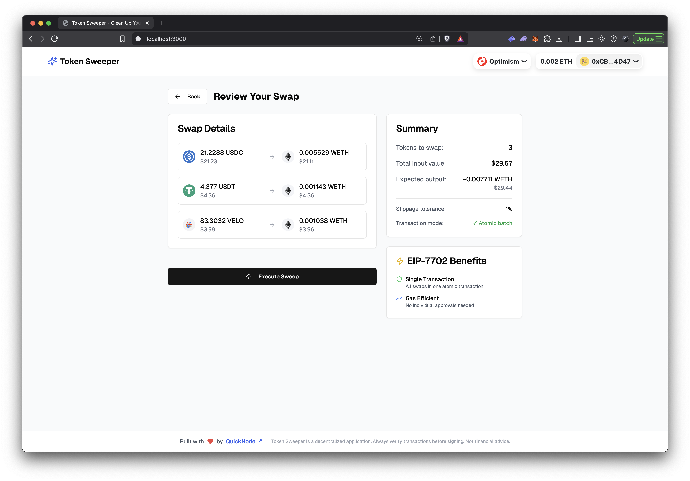
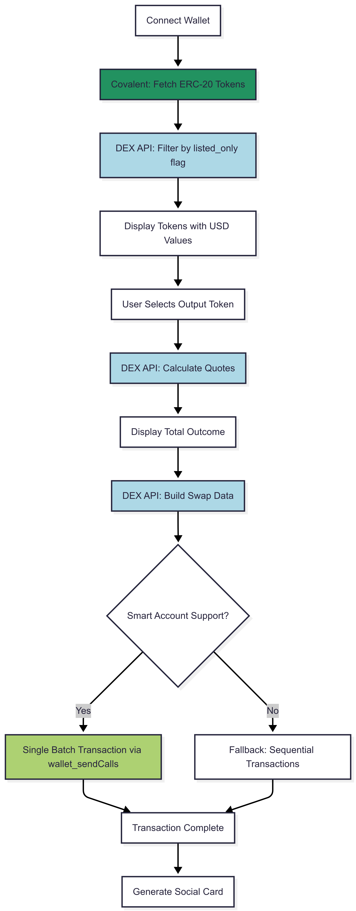
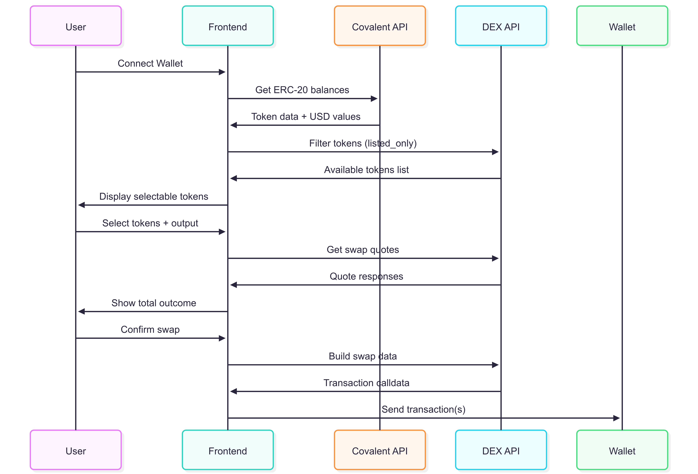

# Token Sweeper 🧹

Token Sweeper is a DeFi application that enables users to efficiently **sweep** multiple small ERC-20 token balances into a single preferred token using EIP-7702 batch transactions. Experience atomic swaps with a single signature across Base and Optimism mainnets.

## 🚀 Key Features

### Core Functionality
- **🔄 Multi-Token Consolidation**: Convert multiple dust tokens into a single preferred token with optimal routing
- **⚡ EIP-7702 Batch Transactions**: Execute all swaps atomically in a single transaction signature
- **📊 Real-time Portfolio Tracking**: Live token balance fetching via Covalent GoldRush Token API
- **🛡️ Advanced Spam Filtering**: Spam/scam token detection via Covalent GoldRush Token API and Aerodrome/Velodrome Swap APIs
- **🌐 Multi-Chain Support**: Full support for Base (8453) and Optimism (10) with native DEX integration (Aerodrome and Velodrome)
- **📱 Social Achievement Cards**: Generate and share beautiful post-swap achievement cards



## 📊 Technical Architecture

### Application Workflow Diagram


### Application Sequence Diagram




### 📁 Project Structure

```
token-sweeper/
├── app/                          # Next.js App Router
│   ├── api/                      # API routes
│   │   ├── covalent/             # Covalent API integration
│   │   ├── swap/                 # Swap API integration
│   │   └── tokens/               # Token API integration
│   ├── layout.tsx               # Root layout with providers
│   ├── page.tsx                 # Main application component
│   └── globals.css              # Global styles
├── components/                   # React components
│   ├── ui/                      # shadcn/ui components
│   │   ├── button.tsx
│   │   ├── card.tsx
│   │   ├── badge.tsx
│   │   └── ...
│   ├── eip-7702-info.tsx       # EIP-7702 information display
│   ├── footer.tsx              # App footer
│   └── providers.tsx           # Context providers
│   ├── social-card.tsx         # Shareable achievement cards
│   ├── swap-configuration.tsx   # Swap quotes and execution
│   ├── token-portfolio.tsx      # Token selection interface
│   ├── wallet-connection.tsx    # Wallet connection interface
├── hooks/                       # Custom React hooks
│   ├── use-outcome-tokens.ts   # DEX token fetching
│   ├── use-swap-builder.ts     # Transaction building
│   ├── use-swap-quotes.ts      # Swap quote fetching
│   ├── use-token-balances.ts   # Covalent API integration
│   ├── use-verified-tokens.ts  # Token verification (cached)
├── lib/                        # Utility functions
│   ├── config.ts              # Application configuration
│   ├── env-validation.ts      # Environment validation
│   ├── logger.ts              # Structured logging
│   ├── token-config.ts        # Token configurations
│   └── utils.ts               # General utilities
├── types/                      # Type definitions
│   ├── index.ts               # Main type exports
├── package.json               # Dependencies and scripts
├── tailwind.config.ts         # Tailwind CSS configuration
├── next.config.mjs           # Next.js configuration
└── tsconfig.json             # TypeScript configuration
```

## 🛠️ Technology Stack

### Frontend Framework
- **Next.js 14**: React framework with App Router
- **TypeScript**: Type-safe development
- **Tailwind CSS**: Utility-first CSS framework
- **shadcn/ui**: Modern React component library

### Web3 Integration
- **Wagmi**: React hooks for Ethereum
- **Viem**: TypeScript interface for Ethereum
- **RainbowKit**: Wallet connection
- **EIP-7702**: Atomic batch transaction support

### APIs & Data Sources
- **[Covalent GoldRush Wallet API](https://marketplace.quicknode.com/add-on/covalent-wallet-api)**: Token balance fetching
- **[Aerodrome Swap API](https://marketplace.quicknode.com/add-on/aerodrome-swap-api)**: Quotes and swaps on Aerodrome, leading DEX on Base
- **[Velodrome Swap API](https://marketplace.quicknode.com/add-on/velodrome-swap-api)**: Quotes and swaps on Velodrome, leading DEX on Optimism

### State Management
- **React Hooks**: Component-level state
- **TanStack Query**: Server state management
- **Local Caching**: API response caching (5-minute TTL)

## 🚦 Getting Started

### Prerequisites

To run and use this application, you will need the following:

- Node.js 20+
- A [Quicknode](http://dashboard.quicknode.com/) account with Base or Optimism endpoints
- The [Covalent Token API](https://marketplace.quicknode.com/add-on/covalent-wallet-api) add-on (_free tier not available_) and [Aerodrome](https://marketplace.quicknode.com/add-on/aerodrome-swap-api) or [Velodrome Swap API](https://marketplace.quicknode.com/add-on/velodrome-swap-api) add-on (_free tier available_)
- Project ID from [Reown, formerly WalletConnect](https://cloud.reown.com/)
- MetaMask or compatible wallet with EIP-7702 support

#### Setting Up Quicknode

1. **Create Endpoints**: Log in to your [Quicknode account](http://dashboard.quicknode.com/) and create a new endpoint for each chain you want to support. For this guide, we will use Base and Optimism.

> Since these API add-ons are available on mainnet only, you will need to set up your Quicknode account with a mainnet endpoint.

2. **Install Add-ons**:

- Once you are in your endpoint's dashboard, navigate to the **Add-ons** for your endpoint.
- Install the [Covalent Token API](https://marketplace.quicknode.com/add-on/covalent-wallet-api) add-on.
- Install the [Aerodrome Swap API](https://marketplace.quicknode.com/add-on/aerodrome-swap-api) and [Velodrome Swap API](https://marketplace.quicknode.com/add-on/velodrome-swap-api) add-ons. You can use the free tier for the swap APIs to start.

3. **Get Covalent API Key**: Click **Sign in to Dashboard** next to the Covalent Token API add-on. This will redirect you to the Covalent dashboard where you can find your API key.

4. **Get Swap API URLs**: Click **Getting Started** next to the Aerodrome or Velodrome Swap API add-on. This will show you the base API URLs you need to use in your application. Use the URL before the `/v1/...` part, as we will append the specific endpoints in our code. It should look something like this: `https://YOUR-QUICKNODE-ENDPOINT-URL/addon/YOUR-ADDON-ID`

#### Setting Up Reown (formerly, WalletConnect)

1. **Create a Reown (formerly, WalletConnect) Project**: Head to the [Reown Cloud](https://cloud.reown.com/) and create a new project. You can name it whatever you want.

2. **Get Project ID**: After creating the project, you will be redirected to the project dashboard. Here, you can find your Project ID, which you'll need to use in your application.

### Installation Dependencies

1. **Clone the repository**

```bash
git clone https://github.com/quiknode-labs/qn-guide-examples.git
cd qn-guide-examples/sample-dapps/token-sweeper-eip-7702
```

2. **Install dependencies**

```bash
npm install
# or using yarn
yarn install
# or using pnpm
pnpm install
```

3. **Set up environment variables**
```bash
cp .env.example .env.local
```

Required environment variables:
```bash
COVALENT_API_KEY=your-covalent-api-key
NEXT_PUBLIC_WALLETCONNECT_PROJECT_ID=your-walletconnect-project-id
NEXT_PUBLIC_BASE_RPC_URL=your-base-rpc-url
NEXT_PUBLIC_OPTIMISM_RPC_URL=your-optimism-rpc-url
AERODROME_BASE_API=aerodrome-api-endpoint
VELODROME_OPTIMISM_API=velodrome-api-endpoint
```

4. **Start the development server**
```bash
npm run dev
# or using yarn
yarn dev
# or using pnpm
pnpm dev
```

5. **Visit the application**
```
http://localhost:3000
```

## Using the Application

1. **Connect your wallet**: Click the "Connect Wallet" button and select your wallet provider (e.g., MetaMask).
2. **View your token portfolio**: The application will fetch and display your ERC-20 token balances.
3. **Select tokens to sweep**: Choose the tokens you want to consolidate and the preferred output token.
4. **Review swap quotes**: The application will calculate and display the best swap quotes for your selected tokens.
5. **Execute the swap**: Confirm the transaction to sweep your tokens into the preferred token. If you have a smart account, it will execute as a single batch transaction; otherwise, it will process sequentially.
6. **Share your achievement**: After the swap, you can generate a social achievement card to share your success on social media.

## 🌐 Supported Networks

| Network | Chain ID | DEX Integration | Status |
|---------|----------|-----------------|---------|
| Base Mainnet | 8453 | Aerodrome | ✅ Active |
| Optimism Mainnet | 10 | Velodrome | ✅ Active |