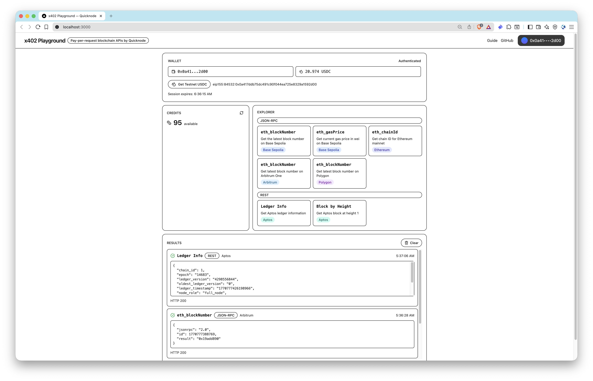

# x402 Explorer — Quicknode Sample App

A sample application demonstrating [Quicknode's x402 protocol](https://www.quicknode.com/guides/x402/access-quicknode-endpoints-with-x402-payments) for pay-per-request blockchain API access. Connect your wallet, authenticate with SIWE, and call RPC/REST methods across multiple chains — each request is paid for with an EVM signature.

## What This App Does

1. **Connect a wallet** via ConnectKit (MetaMask, Coinbase Smart Wallet, etc.)
2. **Authenticate** using Sign-In with Ethereum (SIWE) to receive a session JWT
3. **Request testnet USDC** from the faucet (Base Sepolia)
4. **Execute blockchain methods** across networks (Ethereum, Base Sepolia, Arbitrum, Polygon, Aptos) — if you don't have enough credits, the app automatically purchases them with your testnet USDC
5. **Inspect payment metadata** returned with each response



## Prerequisites

- [Node.js](https://nodejs.org/) v18+
- [pnpm](https://pnpm.io/) v8+
- A browser wallet (e.g. MetaMask) with Base Sepolia testnet configured

## Quick Start

```bash
# 1. Clone the repository
git clone https://github.com/quiknode-labs/qn-guide-examples.git
cd qn-guide-examples/sample-dapps/x402-quicknode

# 2. Install dependencies
pnpm install

# 3. Start the development server
pnpm dev
```

Open [http://localhost:3000](http://localhost:3000) in your browser.

### Optional Environment Variables

| Variable | Default | Description |
|---|---|---|
| `NEXT_PUBLIC_X402_BASE_URL` | `https://x402.quicknode.com` | x402 API base URL |

Create a `.env.local` file to override:

```bash
NEXT_PUBLIC_X402_BASE_URL=https://x402.quicknode.com
```

## How It Works

```
Wallet ──► SIWE Auth ──► JWT Token
                            │
                            ▼
              x402 Fetch Wrapper (JWT + EVM payment signature)
                            │
                            ▼
              Quicknode x402 API ──► Blockchain RPC / REST
```

Each API request is wrapped by `@x402/fetch`, which automatically signs a payment authorization using your connected wallet. The x402 backend verifies the signature, deducts credits, and proxies the request to the target blockchain network.

### Supported Methods

As all JSON-RPC, REST, gRPC-Web, and WebSocket methods are supported, you can call any method available on the target network. For demonstration, the app includes buttons for popular methods:

| Method | Protocol | Network |
|---|---|---|
| `eth_blockNumber` | JSON-RPC | Base Sepolia, Arbitrum, Polygon |
| `eth_gasPrice` | JSON-RPC | Base Sepolia |
| `eth_chainId` | JSON-RPC | Ethereum |
| Ledger Info | REST | Aptos |
| Block by Height | REST | Aptos |

## Project Structure

```
src/
├── app/                  # Next.js App Router (pages & layouts)
├── components/
│   ├── providers.tsx     # Wagmi + React Query + ConnectKit providers
│   └── ...                # UI components (header, panels, cards, etc.)
├── hooks/
│   ├── use-x402-auth.ts  # SIWE authentication state
│   ├── use-credits.ts    # Credit balance fetching
│   └── use-x402-fetch.ts # Authenticated fetch wrapper
└── lib/
    ├── constants.ts      # x402 URLs, chain IDs, contract addresses
    ├── methods.ts        # Available RPC/REST method definitions
    ├── types.ts          # TypeScript types
    └── x402.ts           # Core x402 logic (auth, credits, execution)
```

## Scripts

| Command | Description |
|---|---|
| `pnpm dev` | Start development server |
| `pnpm build` | Create production build |
| `pnpm start` | Start production server |
| `pnpm lint` | Run ESLint |
| `pnpm typecheck` | Run TypeScript type checking |

## Tech Stack

- **Framework**: [Next.js 16](https://nextjs.org/) (App Router)
- **Styling**: [Tailwind CSS 4](https://tailwindcss.com/)
- **Wallet**: [wagmi](https://wagmi.sh/) + [ConnectKit](https://docs.family.co/connectkit)
- **Auth**: [SIWE](https://login.xyz/) (Sign-In with Ethereum)
- **Payments**: [@x402/fetch](https://www.npmjs.com/package/@x402/fetch) + [@x402/evm](https://www.npmjs.com/package/@x402/evm)
- **State**: [TanStack React Query](https://tanstack.com/query)

## Learn More

- [x402 Protocol Documentation](https://www.x402.org/)
- [Examples for using Quicknode Core Node API via x402](https://github.com/quiknode-labs/qn-x402-examples)
- Guides:
  - [Access Quicknode Endpoints with x402 Payments](https://www.quicknode.com/guides/x402/access-quicknode-endpoints-with-x402-payments)

## License

MIT
