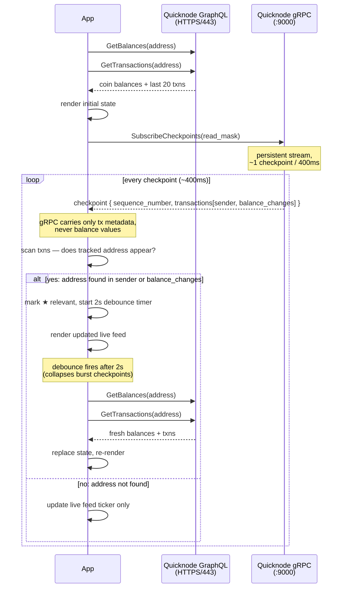

# Sui Portfolio Tracker

A real-time terminal portfolio tracker for Sui, using Quicknode's GraphQL and gRPC APIs.

- **GraphQL** — fetches initial coin balances and transaction history
- **gRPC** — streams live checkpoints and detects activity on your tracked address(es)

## How it works

The app uses two different Quicknode Sui API layers for different jobs:

**Startup (GraphQL)**
On launch, two parallel GraphQL queries run against the Sui GraphQL endpoint for each tracked address:
- `GetBalances` — returns all coin types and balances held by the address
- `GetTransactions` — returns the 20 most recent transactions involving the address

When tracking multiple addresses, balances are displayed per-address and transactions are merged + deduplicated across all addresses.

**Live updates (gRPC)**
After the initial load, the app opens a persistent gRPC streaming connection and calls `SubscribeCheckpoints` on Sui's `SubscriptionService`. Sui produces a new checkpoint roughly every 400–500ms.

gRPC does not provide balance data. Its only job is detection: for each checkpoint, the app scans the transaction list for any of your tracked addresses appearing as a sender or in `balance_changes`. If a match is found, the checkpoint is flagged as relevant (`★`), the balance changes are displayed inline (e.g. `▼ 665.984 SUI ▲ 1,000.000 USDC`), and a **2-second debounced GraphQL re-fetch** fires — replacing the displayed balances and transactions with fresh data from GraphQL.

This makes gRPC a pure notification layer. It replaces polling ("re-fetch every N seconds") with an event-driven signal: something happened on-chain, now go ask GraphQL for the updated state. The debounce collapses bursts (e.g. a DEX trade settling across multiple checkpoints) into a single re-fetch.

Balances are never polled on a timer — they only refresh when the gRPC stream detects on-chain activity for your address(es).



**Reconnection**
If the gRPC stream drops, the app reconnects automatically with exponential backoff (1s, 2s, 4s… up to 30s). The terminal shows `[↺ RECONNECTING]` during this window.

## Prerequisites

- Node.js 20+
- pnpm (`npm install -g pnpm`)
- A [Quicknode](https://www.quicknode.com) Sui mainnet endpoint

## Setup

### 1. Clone the repo

```bash
git clone https://github.com/quiknode-labs/qn-guide-examples.git
cd qn-guide-examples/sui/sui-portfolio-tracker
```

### 2. Clone Sui proto files

The gRPC client requires Sui's protobuf definitions. Clone them into `protos/`:

```bash
git clone https://github.com/MystenLabs/sui-apis.git protos
```

### 3. Install dependencies

```bash
pnpm install
```

### 4. Configure environment

```bash
cp .env.example .env
```

Edit `.env` with your Quicknode endpoint details:

```
QN_ENDPOINT_URL=https://your-endpoint.sui-mainnet.quiknode.pro
QN_ENDPOINT_TOKEN=your-token-here
SUI_ADDRESS=0x...
```

You can track multiple addresses by comma-separating them:

```
SUI_ADDRESS=0xabc...,0xdef...,0x123...
```

**Finding your token:** Your Quicknode endpoint URL looks like
`https://abc123xyz.sui-mainnet.quiknode.pro/abcdef1234567890`
The token is the path segment: `abcdef1234567890`.

### 5. Run

```bash
pnpm start
```

## What you'll see

The static section (balances, transactions) renders once at the top. Below it, checkpoints scroll in real-time:

```
──────────────────────────────────────────────────────────────────────
  SUI PORTFOLIO TRACKER
  Address : 0xabcd...1234
  Updated : 2026-04-09 14:23:01 UTC
──────────────────────────────────────────────────────────────────────

● COIN BALANCES
┌──────────────────────────────────────────┬──────────────────────────────┐
│ Coin Type                                │ Balance                      │
├──────────────────────────────────────────┼──────────────────────────────┤
│ 0x2::sui::SUI                            │ 123.456789000 SUI            │
└──────────────────────────────────────────┴──────────────────────────────┘

● RECENT TRANSACTIONS
...

  [● LIVE] stream connected
  [14:23:01] #12,345,678 ██████  11 txns
  [14:23:01] #12,345,679 ████     7 txns
  [14:23:02] #12,345,680 █████    9 txns  ★ 2 relevant
             ↳ ▼ 665.984 SUI  ▲ 1,000.000 USDC
             ⟳ refreshing balances via GraphQL...
  [14:23:02] #12,345,681 ███      5 txns
```

When a transaction involving your tracked address is detected, the checkpoint is highlighted with `★`, balance changes are shown inline, and a GraphQL re-fetch fires. After the refresh, the static section redraws with updated data and a delta summary.

## Scripts

| Command | Description |
|---|---|
| `pnpm start` | Run with tsx (recommended) |
| `pnpm dev` | Run with file watching |
| `pnpm build` | Compile TypeScript |
| `pnpm start:compiled` | Run compiled output |
